# Ajax

### 一、Ajax大纲介绍

#### 1. Ajax是什么？

- Ajax就  `是`让浏览器跟服务器交互的一套`API`。 它的作用就是可以让【浏览器和服务器】进行交互。
  - 说人话： ajax 是一种 用于`向服务器请求数据`的 技术
- MDN官网传送门:https://developer.mozilla.org/zh-CN/docs/Web/Guide/AJAX

#### 2. 学习Ajax的目标是什么？

- 学会使用ajax 根据 `接口文档` 和 服务器 `交互`
  - 目前，我们网页所有的数据都是写死的。实际开发中，网页的数据需要从服务器获取。而ajax技术就是来实现这一功能的。

#### 3. 如何学习Ajax

- 1.服务器了解
  - a. 什么是服务器
  - b.服务器的交互流程
- 2.ajax工作流程
- 3.可以使用ajax向服务器请求数据
- 4.ajax综合案例应用


### 二、服务器介绍

#### 1. 什么是服务器?

- 1.`服务器` 就`是`提供某种服务（服务器有很多种）的 `电脑`(机器)
- 2.如何让电脑提供某种服务呢？`安装软件`
  - 想让你的电脑提供 `听歌` 服务，需要装什么软件呢？
    - 网易云、qq音乐
  - 想让你的电脑提供 `视频` 服务，需要装什么软件呢？
    - 爱奇艺，优酷
  - 想让你的电脑提供 `聊天` 服务，需要装什么软件呢？
    - qq，微信
- 3.综上所述，服务器就是某些安装了特殊软件，可以提供某些服务的电脑。常见的服务器有以下几种
  - 数据库服务器
  - 文件服务器 （迅雷）
  - 多媒体服务器(音视频)（qq音乐）
  - 邮件服务器（qq邮箱）
  - Web服务器（谷歌）
- 4.要想让你的电脑成为一台Web服务器，我们只需要**安装对应的软件**即可。
  - 由于这些软件涉及的专业知识属于后台开发领域，我们的重点是了解什么是服务器，并且我们是前端开发，所以我们主要学习如何使用前端中的软件来和服务器进行交互。那么我们前端主要使用什么软件来和服务器进行交互呢？（Chrome）

#### 2. 服务器交互流程

- 为什么刚刚我们只需要在浏览器输入一个网址点击回车之后就可以看到网页呢？
- 为什么我们修改了网页之后，需要在浏览器刷新以下才能看到最新的内容呢？
- 为什么在浏览器输入 <http://www.baidu.com>就可以看到百度网页呢？
- 为什么在浏览器输入 <http://www.jd.com>就可以看到京东网页呢？
- 其实，浏览器和服务器之间的每一次交互，都是由三个部分组成
  - 请求  (**浏览器**发起请求，服务器接收，前端)
  - 处理（**服务器**处理这个请求，后端）
  - 响应（**服务器**响应数据给浏览器，后端）


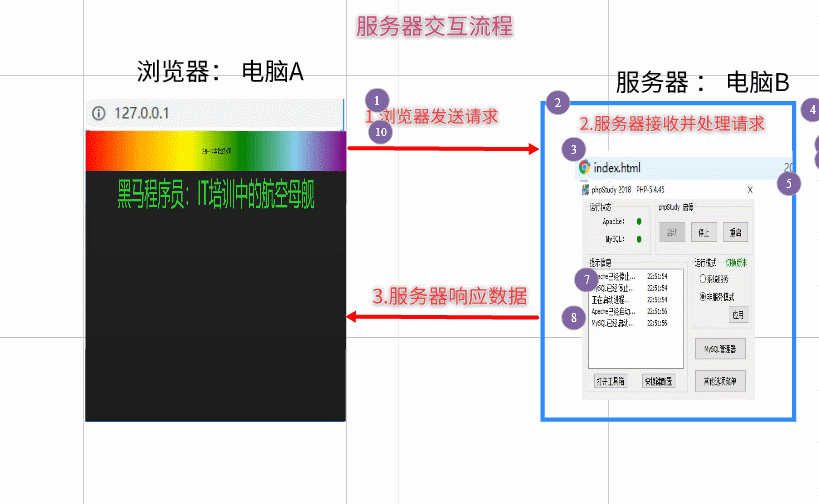

#### 3. 浏览器访问服务器的几种方式（代码01）

```html
<!DOCTYPE html>
<html lang="en">
<head>
    <meta charset="UTF-8">
    <meta name="viewport" content="width=device-width, initial-scale=1.0">
    <meta http-equiv="X-UA-Compatible" content="ie=edge">
    <title>Document</title>
    <style>
        
    </style>
</head>

<a href="http://192.168.137.1">点我跳转</a>
<button id="btn">点我也可以跳转哟</button>

<body>
    <script>
        /*几种访问服务器的方式
        1.直接在浏览器地址栏输入网址
        2.使用a标签的href属性
        3.使用window.location.href 
        1-3 网页会跳转（全局刷新）
        4.ajax技术 网页不会跳转 （局部刷新）
         */

        document.getElementById('btn').onclick = function(){
            window.location.href = 'http://192.168.137.1';
        };
    </script>
</body>
</html>
```


### 三、ajax工作流程

#### 1. 什么是ajax？(局部刷新)

- **ajax（阿贾克斯）：在`不刷新页面`的情况下向服务器请求数据**
  - [ajax技术真实网站介绍](https://www.smzdm.com/)
  - [ajax效果预览](file:///C:/Users/%E5%BC%A0%E6%99%93%E5%9D%A4/Desktop/%E5%BC%A0%E6%99%93%E5%9D%A4%E5%89%8D%E7%AB%AF%E5%A4%87%E8%AF%BE%E8%B5%84%E6%96%99/AB%E6%A8%A1%E5%BC%8F/06-Ajax/%E8%AF%BE%E7%A8%8B%E8%B5%84%E6%96%99/%E5%A4%87%E8%AF%BE%E4%BB%A3%E7%A0%81/day01/09-%E6%A1%88%E4%BE%8B%EF%BC%9A%E8%8B%B1%E9%9B%84%E6%9F%A5%E8%AF%A2.html)

#### 2. 为什么需要ajax？

- 1.以前我的写的页面全部都是固定的假数据，其实网页的数据都是从服务器获取的，一旦服务器数据变化，网页上的内容也会发生变化
- 2.虽然可以通过在浏览器地址栏直接输入网址（url）的方式向服务器获取数据，但是我们的网页会刷新
- 3.学会ajax：就可以做到在不刷新网页的情况下向服务器请求数据，让网站数据内容动态变化。

#### 3. ajax的工作流程(代码02)

- 1.创建XMLHttpRequest对象（俗称小黄人）
  - `let xhr = new XMLHttpRequest();`
- 2.设置请求方法和请求地址（公司后台人员设置/接口文档）
  - `xhr.open('method', 'url');`
- 3.发送请求
  - `xhr.send();`
- 4.注册响应回调函数
  - - 这个函数不是立即执行的，而是等服务器把数据响应返回才会执行（PS：什么时候执行取决于你的网速快慢、带宽、天气、服务器、运营商等）
    - `xhr.onload（）`是网络加载完成执行
    - `xhr.onload = function () {console.log(xhr.responseText);}`

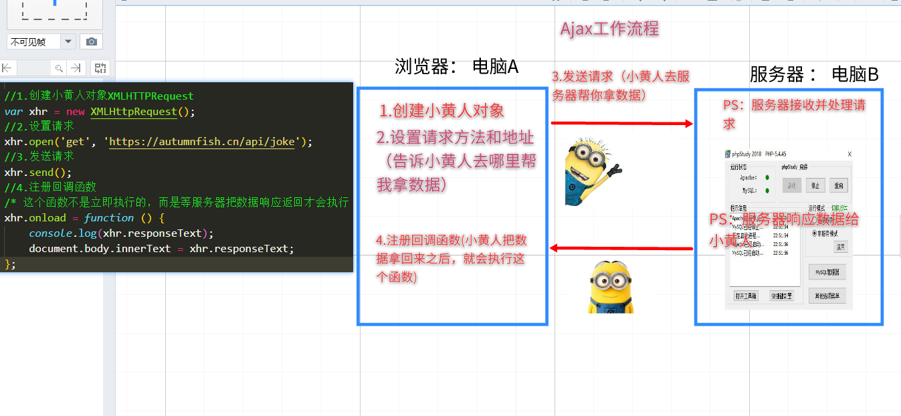

```html
<!DOCTYPE html>
<html lang="en">

<head>
    <meta charset="UTF-8">
    <meta name="viewport" content="width=device-width, initial-scale=1.0">
    <meta http-equiv="X-UA-Compatible" content="ie=edge">
    <title>Document</title>

    <script src="./jquery-1.12.4.min.js"></script>
</head>

<body>
    <script>
      
        /* 1.ajax技术： 在页面不刷新的情况下向服务器请求数据
           2.Ajax语法：使用内置对象XMLHttpRequest ： http请求对象，负责实现ajax技术（小黄人）
                （1）创建XMLHttpRequest对象
                        * 小黄人，相当于黄袍加身的跑腿外卖小哥哥
                （2）设置请求
                        * 告诉小黄人服务器地址
                （3）发送请求
                        * 小黄人出发去指定地址取外卖（数据）
                            * 2G网速：走路去的
                            * 3G网速：骑膜拜去的
                            * WIFI : 骑电动车去的
                            * 4G   ： 骑小牛牌电动车去的
                （4）注册回调函数
                        * 小黄人把取回的外卖送到你家门口
        
         */

        //1.创建小黄人对象XMLHTTPRequest
        let xhr = new XMLHttpRequest();
        //2.设置请求
        xhr.open('get', 'https://autumnfish.cn/api/joke');
        //3.发送请求
        xhr.send();
        //4.注册回调函数
        /* 这个函数不是立即执行的，而是等服务器把数据响应返回才会执行（PS：什么时候执行取决于你的网速快慢） */
        xhr.onload = function () {
            console.log(xhr.responseText);
            document.body.innerText = xhr.responseText;
        };
    </script>
</body>

</html>
```


### 四、名词解释（课后了解）

- Ajax 即“**Asynchronous Javascript And XML**”（异步 JavaScript 和 XML），是指一种创建交互式网页应用的网页开发技术。                
- **说人话**：ajax就是一套可以让网站跟服务器交互的一种技术，能在我们需要时，不用再刷新网页就能去服务器要一些数据回来
- 例：http://www.smzdm.com 里只要网站往下滚动，就能不用刷新页面跟服务器要数据

#### 1. 案例：看笑话

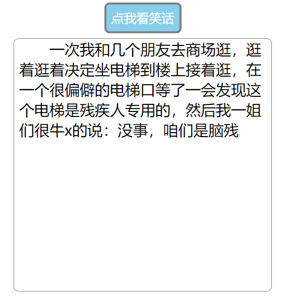

```html
<!DOCTYPE html>
<html lang="en">
  <head>
    <meta charset="UTF-8" />
    <meta http-equiv="X-UA-Compatible" content="IE=edge" />
    <meta name="viewport" content="width=device-width, initial-scale=1.0" />
    <title>Document</title>
    <style>
      body {
        text-align: center;
      }
      .getJoke {
        padding: 10px 20px;
        text-align: center;
        color: white;
        background-color: skyblue;
        cursor: pointer;
        border-radius: 5px;
      }
      .joke-container {
        margin: 10px auto;
        width: 300px;
        height: 300px;
        border: 1px solid #000;
      }
    </style>
  </head>
  <body>
    <input type="button" value="点我看笑话" class="getJoke" />
    <div class="joke-container"></div>
    <script>
      /*    随机获取笑话的接口
      
      - 请求地址：https://autumnfish.cn/api/joke
      - 请求方法：get
      - 请求参数：无
      - 响应内容：随机笑话 */
      // 1.点击按钮
      document.querySelector('.getJoke').addEventListener('click', function () {
        // 2.ajax发送请求
        // (1) 创建xhr对象
        let xhr = new XMLHttpRequest()
        // (2) 设置请求方法 和请求地址
        xhr.open('get', 'https://autumnfish.cn/api/joke')
        // (3) 发送请求
        xhr.send()
        // (4) 注册响应事件
        xhr.onload = function () {
          // 3.服务器响应数据之后，把数据显示到页面（渲染页面）
          document.querySelector('.joke-container').innerHTML = xhr.responseText
        }
      })
    </script>
  </body>
</html>
```


### 五、Ajax发送get请求与post请求

请求方法不区分大小写

#### 1. get请求

```html
<!DOCTYPE html>
<html lang="en">
  <head>
    <meta charset="UTF-8" />
    <meta name="viewport" content="width=device-width, initial-scale=1.0" />
    <meta http-equiv="X-UA-Compatible" content="ie=edge" />
    <title>Document</title>
  </head>

  <body>
    <script>
      /*
        1.get传参格式： url?key=value
        2.示例： https://autumnfish.cn/api/joke/list?num=10
      */

      // 1.实例化ajax对象，创建xhr
      let xhr = new XMLHttpRequest()
      // 2.设置请求方法和地址
      // get请求的数据直接添加在url的后面 格式是 url?key=value
      xhr.open("get", "https://autumnfish.cn/api/joke/list?num=10")
      // 3.发送请求
      xhr.send()
      // 4.注册回调函数
      xhr.onload = function() {
        console.log(xhr.responseText)
      }
    </script>
  </body>
</html>

```

#### 2. post请求

```html
<!DOCTYPE html>
<html lang="en">
  <head>
    <meta charset="UTF-8" />
    <meta http-equiv="X-UA-Compatible" content="IE=edge" />
    <meta name="viewport" content="width=device-width, initial-scale=1.0" />
    <title>Document</title>
  </head>
  <body>
    <script>
      /*  传参方式区别：get是url传参，post是请求体传参
        1.Ajax发送get请求参数：在url后面拼接
        格式：url?key=value 
         * 参数在url中，安全性不高
        2.Ajax发送post请求：
          区别
           (1)post请求需要单独设置请求头：不需要记，固定格式，建议复制粘贴
           xhr.setRequestHeader('Content-type', 'application/x-www-form-urlencoded')
          （2）post参数在xhr.send()方法中发送
          格式：xhr.send('key=value')
          * 注意：不要加前面的?
        */

      // (1)创建xhr
      let xhr = new XMLHttpRequest()
      // (2)设置请求方法和请求地址
      xhr.open('post', 'https://autumnfish.cn/api/user/register')
      // (3)设置请求
      xhr.setRequestHeader('Content-type', 'application/x-www-form-urlencoded')
      // (4)发送请求
      xhr.send('username=张')
      // (5)注册响应事件
      xhr.onload = function () {
        console.log(xhr.responseText)
      }
    </script>
  </body>
</html>
```

#### 3. get和post区别

* 传参方式不同：

  1. get请求直接在url传参 

      （1） 'url?key=value' 

  2. post在请求体传参  

  		 （1）xhr.send('key=value')
  		
  		 （2）xhr.setRequestHeader('Content-type', 'application/x-www-form-urlencoded')


### 六、综合案例


#### 1-用户登录

```html
<!DOCTYPE html>
<html lang="en">
  <head>
    <meta charset="UTF-8" />
    <meta http-equiv="X-UA-Compatible" content="IE=edge" />
    <meta name="viewport" content="width=device-width, initial-scale=1.0" />
    <title>Document</title>
    <link rel="stylesheet" href="./css/bootstrap-v4.6.0.css" />
    <style>
      body {
        background-color: #ccc;
      }
      .login {
        margin: 100px auto;
        padding: 15px;
        width: 400px;
        height: 300px;
        background-color: #fff;
        border-radius: 10px;
      }
    </style>
  </head>
  <body>
    <div class="login">
      <div class="form-group">
        <!-- 用户名 -->
        <label for="username">用户名:</label>
        <input
          type="text"
          class="form-control"
          id="username"
          aria-describedby="emailHelp"
        />
        <small id="emailHelp" class="form-text text-muted"
          >初始用户名:admin</small
        >
      </div>
      <div class="form-group">
        <!-- 密码 -->
        <label for="password">密码:</label>
        <input type="password" class="form-control" id="password" />
        <small id="emailHelp" class="form-text text-muted"
          >初始密码:123456</small
        >
      </div>
      <button type="submit" class="btn btn-primary" id="btnLogin">登录</button>
    </div>
    <script>
      /* 分析
      1.点击登录
      2.获取输入框文本，非空判断
      3.ajax发送请求
      4.服务器响应
       code:200  成功，跳转首页
			 code:500  失败，弹窗提示用户 */

      // 1.点击登录
      document
        .querySelector('#btnLogin')
        .addEventListener('click', function () {
          // 2.获取输入框文本(value)，非空判断
          let username = document.querySelector('#username').value
          let password = document.querySelector('#password').value
          if (username == '' || password == '') {
            return alert('输入框不能为空')
          }
          // 3.ajax发送请求
          // (1)创建xhr
          let xhr = new XMLHttpRequest()
          // (2)设置请求方法和请求地址
          xhr.open('post', 'http://www.liulongbin.top:3009/api/login')
          // (3)设置请求
          xhr.setRequestHeader(
            'Content-type',
            'application/x-www-form-urlencoded'
          )
          // (4)发送请求
          xhr.send(`username=${username}&password=${password}`)
          // (5)注册响应事件
          xhr.onload = function () {
            // console.log(xhr.responseText)
            // 4.服务器响应之后 JSON->JS
            let res = JSON.parse(xhr.responseText)
            console.log(res)
            if (res.code == 200) {
              alert(res.msg)
              location.href = 'http://baidu.com'
            } else {
              alert(res.msg)
            }
          }
        })
    </script>
  </body>
</html>
```


#### 2-新闻列表


```html
<!DOCTYPE html>
<html lang="en">

<head>
  <meta charset="UTF-8" />
  <meta name="viewport" content="width=device-width, initial-scale=1.0" />
  <meta http-equiv="X-UA-Compatible" content="ie=edge" />
  <title>Document</title>
  <style>
    .news-item {
  display: flex;
  border: 1px solid #eee;
  width: 700px;
  padding: 10px;
  margin-bottom: 5px;
}

.thumb {
  display: block;
  width: 230px;
  height: 140px;
  background-color: #ccc;
  margin-right: 10px;
}

.right-box {
  display: flex;
  flex-direction: column;
  justify-content: space-between;
  font-size: 12px;
  flex: 1;
}

.title {
  font-size: 20px;
  font-weight: normal;
}

.tags span {
  display: block;
  float: left;
  background-color: #F0F0F0;
  line-height: 20px;
  padding: 0 10px;
  border-radius: 10px;
  margin-right: 8px;
}

.footer {
  display: flex;
  justify-content: space-between;
}

    </style>
</head>

<body>

  <!-- 新闻列表 -->
  <div id="news-list">
    <!-- 新闻的 item 项 -->
    <div class="news-item">
      
      <div class="right-box">
        <!-- 新闻标题 -->
        <h1 class="title">5G商用在即，三大运营商营收持续下降</h1>
        <div class="footer">
          <div>
            <!-- 新闻来源 -->
            <span>胡润百富</span>&nbsp;&nbsp;
            <!-- 发布日期 -->
            <span>2019-10-28 10:14:38</span>
          </div>
          <!-- 评论数量 -->
          <span>评论数：66</span>
        </div>
      </div>
    </div>
  </div>

 
  <script>
  /*  1.页面一加载，ajax请求数据(不需要任何交互，页面一进来就执行)
      2.服务器响应数据，渲染页面
        (1)服务器给的是json ->js
        (2)渲染数据
        */

    // 1.请求数据(页面一加载，立刻获取数据，不需要事件的触发)
    //(1).实例化ajax对象
    let xhr = new XMLHttpRequest()
    //(2).设置请求方法和地址
    //get请求的数据直接添加在url的后面 格式是 url?key=value
    xhr.open('get', 'http://www.liulongbin.top:3009/api/news')
    //(3).发送请求
    xhr.send()
    //(4).注册回调函数
    xhr.onload = function() {
      //4.1 服务器返回JSON -> JS对象
      let res = JSON.parse(xhr.responseText)
      console.log(res)
      //4.2  渲染页面
      renderData(res.data)
    }

    /* 将数据渲染到页面有两种方式
      第一种：DOM驱动。  
        方式: 遍历数组,创建元素添加到页面
        弊端: DOM操作比较繁琐
      第二种: 数据驱动。 
        方式: 将数组 隐射成 html字符串，直接替换元素innerHTML
        好处: 无需操作DOM,只需要操作数据即可
    */
    

    //第一种： DOM驱动。webapi阶段的方式,今后不再使用
    function renderDom(arr){
      for(let i = 0;i<arr.length;i++){
        //(1)创建元素
        let div = document.createElement('div')
        //(2)设置内容
        div.innerHTML = `<div class="news-item">
        
        <div class="right-box">
        <!-- 新闻标题 -->
        <h1 class="title">${arr[i].title}</h1>
        <div class="footer">
          <div>
            <!-- 新闻来源 -->
            <span>${arr[i].source}</span>&nbsp;&nbsp;
            <!-- 发布日期 -->
            <span>${arr[i].time}</span>
          </div>
          <!-- 评论数量 -->
          <span>评论数：${arr[i].cmtcount}</span>
        </div>
        </div>
        </div>`
        //(3)添加到页面
        document.querySelector('#news-list').appendChild(div)
      }
    }


    //第二种: 数据驱动。 今后学习和开发推荐方式
    const renderData = arr=>{
      document.querySelector('#news-list').innerHTML = arr.map(item=>{
        return `<div class="news-item">
        
        <div class="right-box">
        <!-- 新闻标题 -->
        <h1 class="title">${item.title}</h1>
        <div class="footer">
          <div>
            <!-- 新闻来源 -->
            <span>${item.source}</span>&nbsp;&nbsp;
            <!-- 发布日期 -->
            <span>${item.time}</span>
          </div>
          <!-- 评论数量 -->
          <span>评论数：${item.cmtcount}</span>
        </div>
        </div>
        </div>`
      }).join('')
    }

  </script>
</body>

</html>
```


#### 3-水果列表


```html
<!DOCTYPE html>
<html lang="en">
  <head>
    <meta charset="UTF-8" />
    <meta http-equiv="X-UA-Compatible" content="IE=edge" />
    <meta name="viewport" content="width=device-width, initial-scale=1.0" />
    <link rel="stylesheet" href="./css/inputnumber.css" />
    <link rel="stylesheet" href="./css/index.css" />
    <title>水果列表</title>
  </head>

  <body>
    <div class="app-container" id="app">
      <!-- 顶部banner -->
      <div class="banner-box"></div>
      <!-- 面包屑 -->
      <div class="breadcrumb">
        <span>🏠</span>
        /
        <span>水果列表</span>
      </div>
      <!-- table -->
      <div class="main">
        <div class="table">
          <!-- 头部 -->
          <div class="thead">
            <div class="tr">
              <div class="th">名字</div>
              <div class="th">图片</div>
              <div class="th">简介</div>
              <div class="th">操作</div>
            </div>
          </div>
          <div class="tbody">
            <div class="tr">
              <div class="td">火龙果</div>
              <div class="td">
                
              </div>
              <div class="td">
                <span class="my-input__inner count">一种好吃的水果</span>
              </div>
              <div class="td">
                <button class="info">查看详情</button>
              </div>
            </div>
          </div>
        </div>
      </div>
    </div>

    <script>
      /* 思路分析
      1.页面一加载,发送ajax请求
      2.服务器响应数据,渲染到页面
      */

      //(1).实例化ajax对象
      let xhr = new XMLHttpRequest()
      //(2).设置请求方法和地址
      //get请求的数据直接添加在url的后面 格式是 url?key=value
      xhr.open("get", "https://autumnfish.cn/fruitApi/fruits")
      //(3).发送请求
      xhr.send()
      //(4).注册回调函数
      xhr.onload = function() {
        // 4.1 将JSON ——> JS对象
        let res = JSON.parse(xhr.responseText)
        console.log(res)
        // 4.2 渲染页面
        renderData(res.data)
      }

      /* 将数据渲染到页面有两种方式
      第一种：DOM驱动。  
        方式: 遍历数组,创建元素添加到页面
        弊端: DOM操作比较繁琐
      第二种: 数据驱动。 
        方式: 遍历数组,拼接html字符串直接替换innerHTML
        好处: 无需操作DOM,只需要操作数据即可
      */
      const renderData = arr => {
        document.querySelector(".tbody").innerHTML = arr.map(item => {
          return `<div class="tr">
              <div class="td">${item.name}</div>
              <div class="td">
                
              </div>
              <div class="td">
                <span class="my-input__inner count">${item.info}</span>
              </div>
              <div class="td">
                <button class="info">查看详情</button>
              </div>
            </div>`
          }).join("")
      }
    </script>
  </body>
</html>

```


### 七、接口文档

#### 1. 什么是接口文档

- 1.接口：Web服务器提供的，让ajax请求的网络地址称之为接口，简称API
- 2.接口文档 ：为了方便开发人员使用，我们的后台小伙伴会提供一种专门的文档，称之为接口文档
  - 接口文档，又称为API文档，可以理解为接口的`使用说明书`
    - 接口文档的本质 ：其实就是后台开发（如php）他们写的函数注释。后台在处理请求的时候一般都会写一些函数
- 3.一个标准的接口文档至少要包含以下三种信息（`只能多，不能少`）
  - a.请求的地址 （url）
  - b.请求的方法 （get或者post）
  - c.请求的参数
- 4.以下是我们这个阶段可能会用到的接口文档，实际开发中为了避免你的`url地址`，`方法`,`参数`写错，一般强烈建议直接`复制粘贴`

#### 2. 接口文档示例

- 这个网站可以找到更多接口：https://github.com/AutumnFish/testApi

##### 2.1 随机获取笑话的接口

- 请求地址：<https://autumnfish.cn/api/joke>
- 请求方法：get
- 请求参数：无
- 响应内容：随机笑话

##### 2.2 获取多条随机笑话

> 随机获取笑话的接口

- 请求地址：https://autumnfish.cn/api/joke/list

- 请求方法：get

- 请求参数：num

  - 示例：https://autumnfish.cn/api/joke/list?num=10

  | 参数名 | 参数说明 | 备注                  |
  | ------ | -------- | --------------------- |
  | num    | 笑话条数 | 类型为数字,不要给错了 |

- 响应内容：JSON

##### 2.3 用户注册

> 注册用户

- 请求地址：https://autumnfish.cn/api/user/register
- 请求方法：post
- 请求参数：username

| 参数名   | 参数说明 | 备注                                          |
| -------- | -------- | --------------------------------------------- |
| username | 用户名   | 不能为空,通过 send 方法传递，格式为 key=value |

```
xhr.send('username=xxx')
```

- 响应内容：注册成功或失败

##### 2.4 用户登录

- 请求地址：http://www.liulongbin.top:3009/api/login
- 请求方法：post
- 请求参数：username  password

| 参数名   | 参数说明 | 备注                  |
| -------- | -------- | --------------------- |
| username | 用户名   | 不能为空,默认为admin  |
| password | 密码     | 不能为空,默认为123456 |

```
xhr.send('username=xxx&password=xxx')
```

- 响应内容：登录成功{code:200}  登录失败{code:500}

##### 2.5 新闻列表

- 请求地址：http://www.liulongbin.top:3009/api/news
- 请求方法：get
- 请求参数：
- 响应内容：json数据

##### 2.6 水果列表

- 请求地址：https://autumnfish.cn/fruitApi/fruits
- 请求方法：get
- 请求参数：
- 响应内容：json数据


##### 2.7 水果列表

- 请求地址：https://autumnfish.cn/fruitApi/fruits
- 请求方法：get
- 请求参数：
- 响应内容：json数据

##### 2.8 水果详情

- 请求地址： https://autumnfish.cn/fruitApi/fruit/:id
- 请求方法: get
- 请求参数：id，在 url 中直接传递
- 响应内容：json
  - icon:base64 的图片，直接设置给`src`即可使用

##### 2.9 基础聊天

- 请求地址：http://www.liulongbin.top:3006/api/robot
- 请求方法：get
- 请求参数：spoken

| 参数名 | 参数说明           | 备注 |
| ------ | ------------------ | ---- |
| spoken | 要跟机器人聊的内容 |      |

- 响应内容：聊天的信息

```
{
  "data": {
    "type": 5000,
    "info": {
      "text": "*^_^*好好好~"
    }
  },
  "message": "success"
}

```

| 参数名  | 类型   | 说明                                        |
| ------- | ------ | ------------------------------------------- |
| data    | object | 服务器返回的消息对象                        |
| + type  | int    | 获取聊天消息是否成功的状态码，5000 表示成功 |
| + info  | object | 聊天消息对象                                |
| ++ text | string | 机器人返回的聊天内容                        |
| message | string | 请求结果的描述消息                          |

##### 2.10 文字转语音

- 请求地址：http://www.liulongbin.top:3006/api/synthesize
- 请求方法：get
- 请求参数：text

| 参数名 | 参数说明       | 备注 |
| ------ | -------------- | ---- |
| text   | 要转语音的文字 |      |

- 响应内容：语音的 url

```
{
  "status": 200,
  "message": "success",
  "voiceUrl": "https://dds.dui.ai/runtime/v1/synthesize?voiceId=qianranfa&speed=0.8&volume=100&audioType=wav&text=%E4%BD%A0%E5%A5%BD"
}

```

| 参数名   | 类型   | 说明                                        |
| -------- | ------ | ------------------------------------------- |
| status   | int    | 请求是否成功，200：成功，否则失败           |
| message  | string | 请求结果的描述消息                          |
| voiceUrl | string | 语音消息的 URL 地址，可通过 `` 标签进行播放 |

##### 2.11 根据类型查询角色

> 查询英雄的 详细信息

- 请求地址：https://autumnfish.cn/api/cq/category
- 请求方法：get
- 请求参数：type

| 参数名 | 参数说明 | 备注                                                  |
| ------ | -------- | ----------------------------------------------------- |
| type   | 英雄类型 | 不能为空，可选值有:剑士，骑士，弓手，猎人，法师，祭司 |

- 响应内容：JSON

```
{
    "msg": "获取法师英雄数据",
    "code": 200,
    "data": {
        "heros": [
            {
            "heroName": "黑袍魔女桃乐丝",
            "heroIcon": "http://p4.qhimg.com/dr/72__/t015a7af93e23e5c67c.png",
            "skillName": "奥能脉冲",
            "skillIcon": "http://p3.qhimg.com/dr/52__/t01179c3d8588da2733.png",
            "weaponName": "月之女王",
            "weaponIcon": "http://p2.qhimg.com/dr/45__/t01a05a602fe8a972b8.png"
            },
        ]
}

```

图书管理基地址（域名）：http://www.liulongbin.top:3006

##### 2.12 图书列表

- 接口URL（路径）：  /api/getbooks
- 调用方式： GET
- 参数格式：

| 参数名称  | 参数类型 | 是否必选 | 参数说明 |
| --------- | -------- | -------- | -------- |
| id        | Number   | 否       | 图书Id   |
| bookname  | String   | 否       | 图书名称 |
| author    | String   | 否       | 作者     |
| publisher | String   | 否       | 出版社   |

- 响应格式：

| 数据名称   | 数据类型 | 说明                     |
| ---------- | -------- | ------------------------ |
| status     | Number   | 200 成功；500 失败；     |
| msg        | String   | 对 status 字段的详细说明 |
| data       | Array    | 图书列表                 |
| +id        | Number   | 图书Id                   |
| +bookname  | String   | 图书名称                 |
| +author    | String   | 作者                     |
| +publisher | String   | 出版社                   |

- 返回示例：

```json
{
  "status": 200,
  "msg": "获取图书列表成功",
  "data": [
    { "id": 1, "bookname": "西游记", "author": "吴承恩", "publisher": "北京图书出版社" },
    { "id": 2, "bookname": "红楼梦", "author": "曹雪芹", "publisher": "上海图书出版社" },
    { "id": 3, "bookname": "三国演义", "author": "罗贯中", "publisher": "北京图书出版社" }
  ]
}

```


##### 2.13 添加图书

- 接口URL：  /api/addbook
- 调用方式： POST
- 参数格式：

| 参数名称  | 参数类型 | 是否必选 | 参数说明 |
| --------- | -------- | -------- | -------- |
| bookname  | String   | 是       | 图书名称 |
| author    | String   | 是       | 作者     |
| publisher | String   | 是       | 出版社   |

- 响应格式：

| 数据名称 | 数据类型 | 说明                         |
| -------- | -------- | ---------------------------- |
| status   | Number   | 201 添加成功；500 添加失败； |
| msg      | String   | 对 status 字段的详细说明     |

- 返回示例：

```json
{
    "status": 201,
    "msg": "添加图书成功"
}
```


##### 2.14 删除图书

- 接口URL：  /api/delbook
- 调用方式： GET
- 参数格式：

| 参数名称 | 参数类型 | 是否必选 | 参数说明 |
| -------- | -------- | -------- | -------- |
| id       | Number   | 是       | 图书Id   |

- 响应格式：

| 数据名称 | 数据类型 | 说明                                                         |
| -------- | -------- | ------------------------------------------------------------ |
| status   | Number   | 200 删除成功；500 未指定要删除的图书Id；501 执行Sql报错；502 要删除的图书不存在； |
| msg      | String   | 对 status 字段的详细说明                                     |

- 返回示例：

```json
{
    "status": 200,
    "msg": "删除图书成功！"
}
```

##### 2.15 文件上传

- 请求地址：http://www.liulongbin.top:3009/api/upload/avatar
- 请求方法：post
- 请求参数：avatar

| 参数名 | 参数说明 | 备注       |
| ------ | -------- | ---------- |
| avatar | 用户头像 | `图片文件` |

##### 2.16 英雄列表

- 请求地址：https://autumnfish.cn/api/cq/page
- 请求方法：get
- 请求参数：

| 参数名   | 参数说明 | 备注     |
| -------- | -------- | -------- |
| pageNum  | 页数     | 必须要传 |
| pageSize | 每页数量 | 必须要传 |

##### 2.17 英雄搜索

- 请求地址：https://autumnfish.cn/api/cq
- 请求方法：get
- 请求参数：query  不传则默认返回所有英雄

| 参数名 | 参数说明     | 备注                       |
| ------ | ------------ | -------------------------- |
| query  | 英雄名称搜索 | 可以不传，不传返回所有英雄 |

##### 2.18 英雄新增

- 请求地址：https://autumnfish.cn/api/cq/add
- 请求方法：post
- 请求参数：

| 参数名    | 参数说明 | 备注           |
| --------- | -------- | -------------- |
| heroName  | 英雄名称 | 必传，文本类型 |
| heroSkill | 英雄技能 | 必传，文本类型 |
| heroIcon  | 英雄头像 | 必传，图片文件 |


### 八、axios框架使用

- axios(阿克休斯) 官网 : http://www.axios-js.com/

- 1. axios是什么 ：  一个js**框架**，用于发送ajax请求（底层使用XMLHttpRequest）

- 1. 为什么要学习axios :  

     （1）后面vue课程，我们使用axios发送ajax请求 

     （2）大家今后实际开发也是使用axios发送ajax请求

  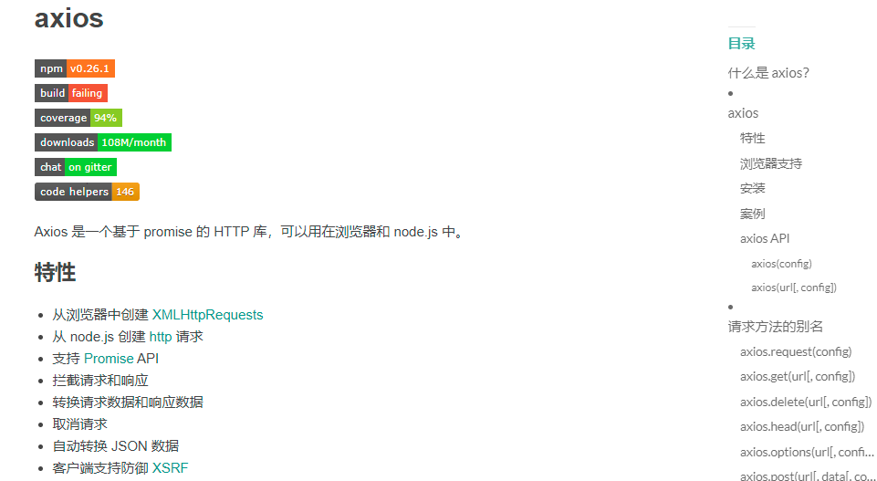

#### 1. axios基本使用

- 官网文档：http://www.axios-js.com/zh-cn/docs/

- axios语法：

  > axios
  >
  > 	.get('url')
  > 		
  > 	.then(res=>{//请求成功})
  > 		
  > 	.catch(err=>{//请求失败})
  > 		
  > 	.then(()=>{//请求完成})

```html
<!DOCTYPE html>
<html lang="en">
  <head>
    <meta charset="UTF-8" />
    <meta name="viewport" content="width=device-width, initial-scale=1.0" />
    <meta http-equiv="X-UA-Compatible" content="ie=edge" />
    <title>Document</title>
  </head>

  <body>
    <button class="btn1">基本使用</button>
    <button class="btn2">点我发送get请求</button>
    <button class="btn3">点我发送post请求</button>

    <!-- 导入axios -->
    <script src="./axios.js"></script>
    <script>
      //基本使用
      document.querySelector(".btn1").onclick = function() {
        /* 
        get() : 写url和请求参数
        then(res=>{}) : 成功回调， 相当于以前jq的success，相当于onload（）
        catch(err=>{}):失败回调，   一般可以省略不写
        then(()=>{}):完成回调，  表示请求完成，无论成功失败都会执行。一般可以省略不写
        */
        axios
          .get("https://autumnfish.cn/api/joke/list?num=10")
          .then(res => {
            //请求成功
            //res:是axios库对响应数据做的一层包装
            //res.data:才是服务器响应的数据，axios库自动把json转为js
            console.log(res)
          })
          .catch(err => {
            //请求失败 : (1)url路径写错了  (2)网络出问题了
            console.log(err)
          })
          .then(() => {
            //请求完成，无论成功失败
            console.log("本次请求完成")
          })
      }

      //get请求
      document.querySelector(".btn2").onclick = function() {
        //get方法第一个参数是url
        //get方法第二个参数是对象类型  { params:{get参数对象}  }
        //此方法与27行等价
        axios
          .get("https://autumnfish.cn/api/joke/list", {
            params: {
              num: 10
            }
          })
          .then(res => {
            //请求成功
            console.log(res)
          })
      }

      //post请求
      document.querySelector(".btn3").onclick = function() {
        //post方法第一个参数是url
        //post方法第二个参数是对象类型  { post参数对象  }
        axios
          .post("http://www.liulongbin.top:3009/api/login", {
            username: "admin",
            password: "123456"
          })
          .then(res => {
            //请求成功
            console.log(res)
          })
          .catch(err => {
            //请求失败
            console.log(err)
          })
      }
    </script>
  </body>
</html>

```


#### 2. axios推荐用法

```html
<!DOCTYPE html>
<html lang="en">
  <head>
    <meta charset="UTF-8" />
    <meta name="viewport" content="width=device-width, initial-scale=1.0" />
    <meta http-equiv="X-UA-Compatible" content="ie=edge" />
    <title>Document</title>
  </head>

  <body>
    <button class="btn1">基本使用</button>
    <button class="btn2">点我发送get请求</button>
    <button class="btn3">点我发送post请求</button>

    <!-- 导入axios -->
    <script src="./axios.js"></script>
    <script>
      /*
        1.学习目标介绍 ： axios其他使用方式
        2.学习路线 ：
            (1)复习上一小节介绍的两种方式
                axios.get().then()
                axios.post().then()
            (2)介绍第三种使用方式
                axios({
                    url:'请求路径',
                    method:'请求方式',
                    data:{ post请求参数 }, //自动设置请求头
                    params:{ get请求参数 } //自动拼接到url后面
                }).then(res=>{
                    //成功回调
                    //console.log(res)
                });
        */

      //基本使用
      document.querySelector('.btn1').onclick = function() {
        axios({
          url: "https://autumnfish.cn/api/joke/list?num=10",
          method: "get"
        }).then(res => {
          console.log(res)
        })
      }

      //get请求 用params
      document.querySelector('.btn2').onclick = function() {
        axios({
          url: `https://autumnfish.cn/api/joke/list`,
          method: "get",
          params:{
              num:10
          }
        }).then(res => {
          console.log(res)
        })
      }

      //post请求 用data
      document.querySelector('.btn3').onclick = function() {
        axios({
          url: "http://www.liulongbin.top:3009/api/login",
          method: "post",
          data: {
            username: "admin",
            password: "123456"
          }
        }).then(res => {
          console.log(res)
        })
      }
    </script>
  </body>
</html>

```

#### 3. 链式编程的原理

1. 链式语法：对象可以连续调用方法

> axios.get().then().catch()

2. 链式语法底层原理：在对象的方法中返回自身

```html
<body>
    <script>
      let obj = {
        name: '张三',
        age: 18,
        sex: '男',
      }
      //   给对象添加方法
      obj.setName = function (str) {
        this.name = str
        return this
      }
      obj.setAge = function (num) {
        this.age = num
        return this //返回this后当前结果为obj，可以通过点（.）来调用方法
      }
      obj.setSex = function (str) {
        this.sex = str
      }
      //   调用方法
      obj.setAge(22).setName('李四').setSex('女')
      console.log(obj)
    </script>
  </body>
```


### 九、 查看水果详情(url跳转传参)

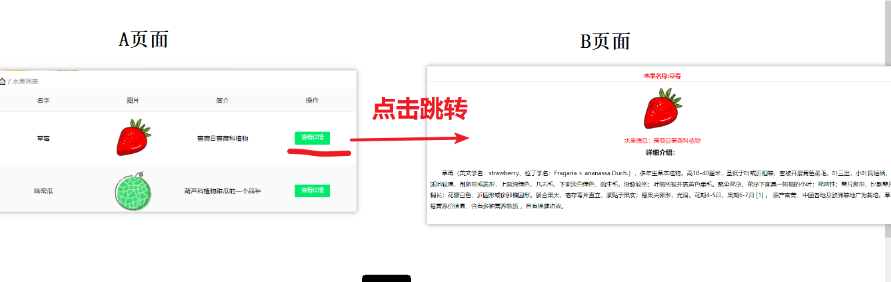


#### 1. 水果列表页(axios实现)

> 		小技巧： 渲染数据功能可以单独封装到函数中。 这样可以让你的代码结构看起来更加清晰，也便于维护

```html
<!DOCTYPE html>
<html lang="en">
  <head>
    <meta charset="UTF-8" />
    <meta http-equiv="X-UA-Compatible" content="IE=edge" />
    <meta name="viewport" content="width=device-width, initial-scale=1.0" />
    <link rel="stylesheet" href="./css/inputnumber.css" />
    <link rel="stylesheet" href="./css/index.css" />
    <title>水果列表</title>
  </head>

  <body>
    <div class="app-container" id="app">
      <!-- 顶部banner -->
      <div class="banner-box"></div>
      <!-- 面包屑 -->
      <div class="breadcrumb">
        <span>🏠</span>
        /
        <span>水果列表</span>
      </div>
      <!-- table -->
      <div class="main">
        <div class="table">
          <!-- 头部 -->
          <div class="thead">
            <div class="tr">
              <div class="th">名字</div>
              <div class="th">图片</div>
              <div class="th">简介</div>
              <div class="th">操作</div>
            </div>
          </div>
          <div class="tbody">
            <div class="tr">
              <div class="td">火龙果</div>
              <div class="td">
                
              </div>
              <div class="td">
                <span class="my-input__inner count">一种好吃的水果</span>
              </div>
              <div class="td">
                <button class="info">查看详情</button>
              </div>
            </div>
          </div>
        </div>
      </div>
    </div>

    <!-- 导入axios -->
    <script src="./lib/axios.js"></script>
    <script>
     /*  动态新增的元素：无法直接注册事件的。解决方法有两种
      1.最常用：事件委托技术 
      2.偶尔用：行内式js注册事件（事件处理只有1行代码时使用）
      <div onclick = "事件处理代码"> </div> *注意是双引号
      url传参：url跳转只由路径决定，参数不会影响页面跳转
      */
      /* 思路分析
      1.页面一加载,发送ajax请求
      2.服务器响应数据,渲染到页面
      3.查看详情点击技术点
        * 使用url实现页面跳转传参    
      */

      //1.页面一加载,发送ajax请求
      axios({
        url:'https://autumnfish.cn/fruitApi/fruits',
        method:'get',
      }).then(res=>{
        //成功回调
        console.log(res)
        //2.服务器响应数据,渲染到页面
        renderData(res.data.data)
      })
      
      //渲染页面函数封装
      const renderData = arr => {
        document.querySelector(".tbody").innerHTML = arr.map(item => {
          return `<div class="tr">
              <div class="td">${item.name}</div>
              <div class="td">
                
              </div>
              <div class="td">
                <span class="my-input__inner count">${item.info}</span>
              </div>
              <div class="td">
                <button class="info" onclick="location.href='./detail.html?id=${item.id}'">查看详情</button>
              </div>
            </div>`
          }).join("")
      }
    
    </script>
  </body>
</html>

```


#### 2. url跳转传参原理（流程总结 A页面到B页面）

- 原理1 :  给`button标签` 注册一个行内js事件（动态新增的按钮不能直接获取，但是可以注册行内事件）
  - `<button onclick="事件处理代码"></button>`
- 原理2：通过拼接url实现跳转传参
  - `location.href = url?key=value`
  - `<button onclick ="location.href ='url?id=参数值'"></button>`
  - 网页跳转由路径决定，无论你后面拼接什么参数，都会跳转

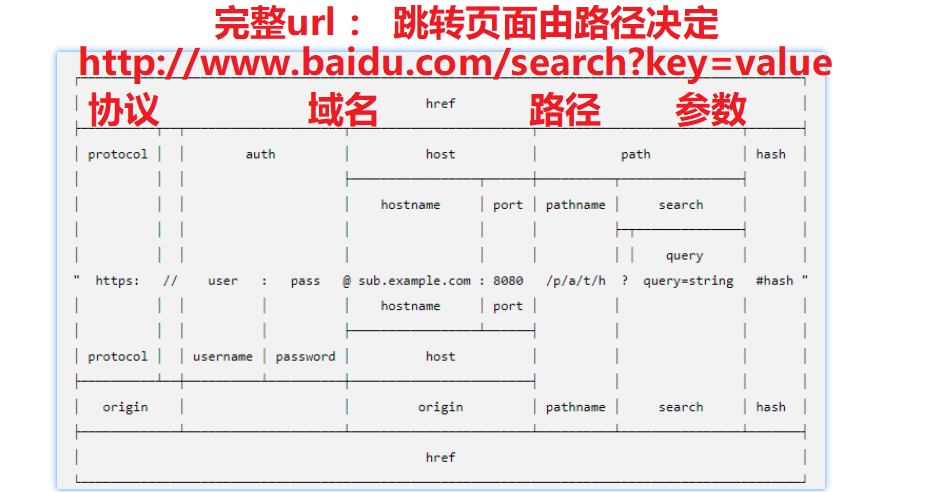

- 原理3 ： 切割url的search参数，得到从其他页面传递过来的参数(B页面写)
  - `let id = location.search.split('=')[1]`

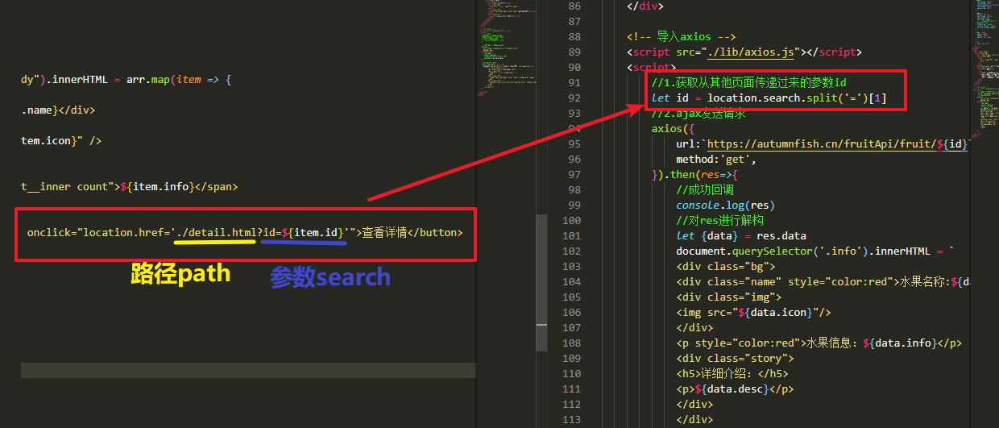


#### 3. 水果详情页

```html
<!DOCTYPE html>
<html lang="en">
  <head>
    <meta charset="UTF-8" />
    <meta name="viewport" content="width=device-width, initial-scale=1.0" />
    <meta http-equiv="X-UA-Compatible" content="ie=edge" />
    <title>Document</title>
    <style>
      * {
        padding: 0;
        margin: 0;
        list-style: none;
      }
      .info {
        display: inline-block;
        flex: 1;
        height: 100%;
        color: #000;
        text-align: center;
      }

      .info .story h5 {
        margin-top: 10px;
      }

      .info .story p {
        padding: 30px 50px;
        text-align: left;
        line-height: 30px;
        font-weight: 500;
        text-indent: 2em;
      }

      .name {
        text-align: center;
        line-height: 30px;
        border-bottom: 1px solid #ccc;
        font-weight: bold;
        margin-top: 15px;
      }

      .img {
        margin: 15px 0;
        text-align: center;
        max-height: 45%;
        overflow: hidden;
        /* 伸缩盒子实现图片居中 */
        display: flex;
        align-items: center;
        justify-content: center;
        vertical-align: middle;
      }

      .img > img {
        width: 120px;
        height: 120px;
        object-fit: cover;
      }

      h5 {
        font-size: 18px;
      }
    </style>
  </head>
  <body>
    <div class="info">
      <div class="bg">
        <div class="name" style="color:red">水果名称:桃子</div>
        <div class="img">
          
        </div>
        <p style="color:red">水果信息：蔷薇目蔷薇科植物</p>
        <div class="story">
          <h5>详细介绍：</h5>
          <p>
            桃（学名：Amygdalus persica
            L.）：蔷薇科、桃属植物。落叶小乔木；叶为窄椭圆形至披针形，长15厘米，宽4厘米，先端成长而细的尖端，边缘有细齿，暗绿色有光泽，叶基具有蜜腺；树皮暗灰色，随年龄增长出现裂缝；花单生，从淡至深粉红或红色，有时为白色，有短柄，直径4厘米，早春开花；近球形核果，表面有毛茸，肉质可食，为橙黄色泛红色，直径7.5厘米，有带深麻点和沟纹的核，内含白色种子。
            是一种果实作为水果的落叶小乔木，花可以观赏，果实多汁，可以生食或制桃脯、罐头等，核仁也可以食用。果肉有白色和黄色的，桃有多种品种，一般果皮有毛，“油桃”的果皮光滑；“蟠桃”果实是扁盘状；“碧桃”是观赏花用桃树，有多种形式的花瓣。
            原产中国，各省区广泛栽培。世界各地均有栽植。
          </p>
        </div>
      </div>
    </div>

    <!-- 导入axios -->
    <script src="./lib/axios.js"></script>
    <script>
        //1.获取从其他页面传递过来的参数id
        let id = location.search.split('=')[1]
        //2.ajax发送请求
        axios({
            url:`https://autumnfish.cn/fruitApi/fruit/${id}`,
            method:'get',
        }).then(res=>{
            //成功回调
            console.log(res)
            //对res进行解构
            let {data} = res.data
            document.querySelector('.info').innerHTML = `
            <div class="bg">
            <div class="name" style="color:red">水果名称:${data.name}</div>
            <div class="img">
            
            </div>
            <p style="color:red">水果信息：${data.info}</p>
            <div class="story">
            <h5>详细介绍：</h5>
            <p>${data.desc}</p>
            </div>
            </div>
            `
        })

    </script>
  </body>
</html>

```


### 十、聊天机器人（锻炼逻辑）

#### 1-DOM驱动思路实现( DOM操作 )

- 1.点击发送按钮
  - 1.1 非空判断
  - 1.2 创建li元素添加到列表
  - 1.3 ajax发送请求
  - 1.4 服务器响应机器人内容 ： 创建li元素添加到页面
  - 1.4 文本清空

```html
<!DOCTYPE html>
<html lang="en">
  <head>
    <meta charset="UTF-8" />
    <meta name="viewport" content="width=device-width, initial-scale=1.0" />
    <meta http-equiv="X-UA-Compatible" content="ie=edge" />
    <link rel="stylesheet" href="css/reset.css" />
    <link rel="stylesheet" href="css/main.css" />
    <script type="text/javascript" src="./lib/jquery-1.12.4.min.js"></script>
    <script type="text/javascript" src="./lib/jquery-ui.min.js"></script>
    <script type="text/javascript" src="./lib/jquery.mousewheel.js"></script>
    <script type="text/javascript" src="./lib/scroll.js"></script>
    <title>聊天机器人</title>
  </head>

  <body>
    <div class="wrap">
      <!-- 头部 Header 区域 -->
      <div class="header">
        <h3>小思同学</h3>
        
      </div>
      <!-- 中间 聊天内容区域 -->
      <div class="main">
        <ul class="talk_list" style="top: 0px;">
          <li class="left_word">
            
            <span>你好</span>
          </li>
          <!-- <li class="right_word">
					
					<span>你好哦</span>
				</li> -->
        </ul>
        <!-- 右侧滚动条 -->
        <div class="drag_bar" style="display: none;">
          <div
            class="drager ui-draggable ui-draggable-handle"
            style="display: none; height: 412.628px;"
          ></div>
        </div>
      </div>
      <!-- 底部 消息编辑区域 -->
      <div class="footer">
        
        <input type="text" placeholder="说的什么吧..." class="input_txt" />
        <input type="button" value="发 送" class="input_sub" />
      </div>
    </div>

    <!-- 引入axios.js -->
    <script src="./lib/axios.js"></script>
    <script>
      /* 本案例特点
       1.并不是所有需要渲染的数据都是来源于服务器 ： 我的聊天内容也要渲染
       2.并不是所有的渲染都是替换 innerHTML : 这个案例在后面拼接
       */
      /* 
		使用dom驱动思路
			1.点击发送
				1.1 非空判断
				1.2 生成一个li标签，添加到页面 
				1.3 发送ajax,获取机器人回复。生成li标签,添加到页面
				1.4 文本清空
		*/

      //1.获取元素
      let txt = document.querySelector(".input_txt")
      let sub = document.querySelector(".input_sub")
      let list = document.querySelector(".talk_list")
      //2.注册点击事件
      sub.onclick = function() {
        //2.1 非空判断
        if (txt.value == "") {
          return alert("输入框内容不能为空！")
        }
        //2.2 生成自己的聊天内容
        let newLi = document.createElement("li")
        newLi.className = "right_word"
        newLi.innerHTML = `<span>${txt.value}</span>`
        list.appendChild(newLi)
        //自动滚到最底部
        resetui()
        //2.3 ajax请求机器人聊天内容
        axios({
          method: "GET",
          url: "http://www.liulongbin.top:3009/api/robot",
          params: {
            spoken: txt
          }
        }).then(({ data: res }) => {
          //生成机器人聊天内容
          let newLi = document.createElement("li")
          newLi.className = "left_word"
          let txt = res.data.info.text
          newLi.innerHTML = `<span>${txt}</span>`
          list.appendChild(newLi)
          //自动滚到最底部
          resetui()
        })
        //2.4 文本清空
        txt.value = ""
      }
    </script>
  </body>
</html>
```


#### 2-数据驱动思路( 数组操作 )

- 1.声明一个全局数组存储聊天内容
- 2.点击发送
  - 2.1 非空判断
  - 2.2 将自己的聊天内容添加到数组中
  - 2.3 ajax发送请求,获取机器人回复内容添加到数组中
  - 2.4 文本清空

```html
<!DOCTYPE html>
<html lang="en">
  <head>
    <meta charset="UTF-8" />
    <meta name="viewport" content="width=device-width, initial-scale=1.0" />
    <meta http-equiv="X-UA-Compatible" content="ie=edge" />
    <link rel="stylesheet" href="css/reset.css" />
    <link rel="stylesheet" href="css/main.css" />
    <script type="text/javascript" src="./lib/jquery-1.12.4.min.js"></script>
    <script type="text/javascript" src="./lib/jquery-ui.min.js"></script>
    <script type="text/javascript" src="./lib/jquery.mousewheel.js"></script>
    <script type="text/javascript" src="./lib/scroll.js"></script>
    <title>聊天机器人</title>
  </head>

  <body>
    <div class="wrap">
      <!-- 头部 Header 区域 -->
      <div class="header">
        <h3>小思同学</h3>
        
      </div>
      <!-- 中间 聊天内容区域 -->
      <div class="main">
        <ul class="talk_list" style="top: 0px;">
          <!-- <li class="left_word">
            
            <span>你好</span>
          </li> -->
          <!-- <li class="right_word">
					
					<span>你好哦</span>
				</li> -->
        </ul>
        <!-- 右侧滚动条 -->
        <div class="drag_bar" style="display: none;">
          <div
            class="drager ui-draggable ui-draggable-handle"
            style="display: none; height: 412.628px;"
          ></div>
        </div>
      </div>
      <!-- 底部 消息编辑区域 -->
      <div class="footer">
        
        <input type="text" placeholder="说的什么吧..." class="input_txt" />
        <input type="button" value="发 送" class="input_sub" />
      </div>
    </div>

    <!-- 引入axios.js -->
    <script src="./lib/axios.js"></script>
    <script>
      /* 
        使用数据驱动思路
            1.声明一个全局数组存储聊天内容,否则会点击全部清空
            2.点击发送
                2.1 非空判断
                2.2 将自己的聊天内容添加到数组中
                2.3 ajax发送请求,获取机器人回复内容添加到数组中
                2.4 文本清空
        */

      //1.获取元素
      let txt = document.querySelector(".input_txt")
      let sub = document.querySelector(".input_sub")
      //声明数组存储聊天内容
      let msgArr = []

      //2.注册点击事件
      sub.onclick = function() {
        //2.1 非空判断
        if (txt.value == "") {
          // 清空所有内容
          txt.value = ""
          return alert("输入框内容不能为空！")
        }
        //2.2 生成自己的聊天内容
        msgArr.push({ msg: txt.value, isMe: true })
        //渲染
        renderData(msgArr)
        //2.3 ajax请求机器人聊天内容
        axios({
          method: "GET",
          url: "http://www.liulongbin.top:3009/api/robot",
          params: {
            spoken: txt
          }
        }).then(({ data: res }) => {
          //机器人内容添加到数组
          msgArr.push({ msg: res.data.info.text, isMe: false })
          //渲染
          renderData(msgArr)
        })
        //2.4 文本清空
        txt.value = ""
      }

      //封装渲染函数
      const renderData = arr => {
        document.querySelector(".talk_list").innerHTML = arr
          .map(item => {
            if (item.isMe) {
              return `<li class="right_word">
					    
					    <span>${item.msg}</span>
				      </li>`
            } else {
              return `<li class="left_word">
					    
					    <span>${item.msg}</span>
				      </li>`
            }
          }).join("")
        //自动滚到最底部
        resetui()
      }
    </script>
  </body>
</html>

```


#### 3-语音转文字功能实现

> 		整体思路

- 1.先给页面添加一个空白的`<audio>标签`，设置autoplay自动播放
  - `<audio autoplay src=""></audio>`
- 2.服务器响应机器人聊天文本之后, 再发送 新的请求，将文本转语音
- 3.服务器响应转换语音之后的url音频，设置给audio标签即可

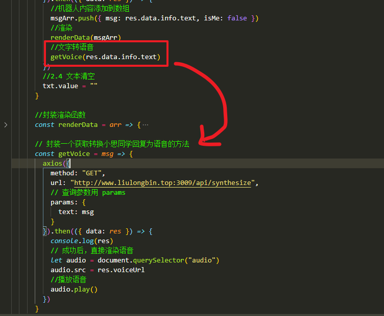

```javascript
// 封装一个获取转换小思同学回复为语音的方法
      const getVoice = msg => {
        axios({
          method: "GET",
          url: "http://www.liulongbin.top:3009/api/synthesize",
          // 查询参数用 params
          params: {
            text: msg
          }
        }).then((res) => {
          console.log(res)
          // 成功后，直接渲染语音
          let audio = document.querySelector("audio")
          audio.src = res.voiceUrl
          //播放语音
          audio.play()
        })
      }
```


### 十一、tab栏切换(网络请求loading效果)

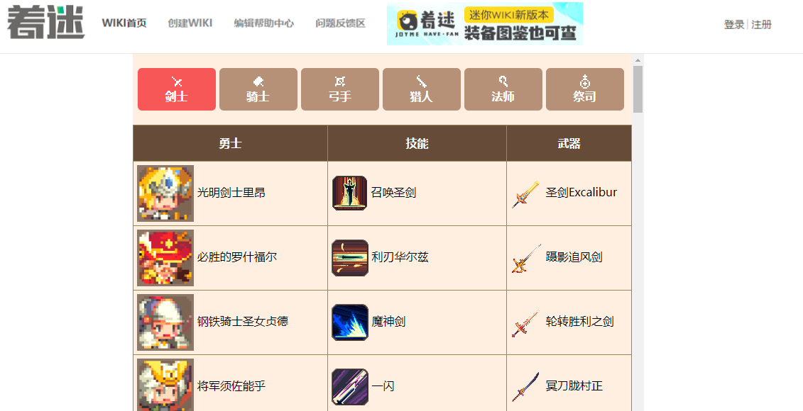

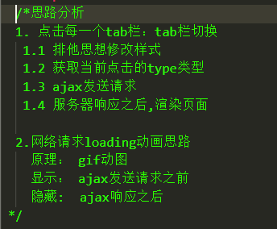


- loading效果实现 : 一般用gif动图 或 自己写一个加载动画
  - 显示loading效果 ： ajax发送之前
  - 隐藏loading效果： 服务器响应数据之后

```html
<!DOCTYPE html>
<html lang="en">
  <head>
    <meta charset="UTF-8" />
    <meta name="viewport" content="width=device-width, initial-scale=1.0" />
    <meta http-equiv="X-UA-Compatible" content="ie=edge" />
    <title>Document</title>
    <link rel="stylesheet" href="./css/index.css" />
  </head>

  <body>
    
    <div class="cq-wrap">
      <!-- 导航 -->
      <div class="nav">
        <ul>
          <li class="active">
            <span>剑士</span>
          </li>
          <li> <span>骑士</span></li>
          <li> <span>弓手</span></li>
          <li> <span>猎人</span></li>
          <li> <span>法师</span></li>
          <li> <span>祭司</span></li>
        </ul>
      </div>
      <!-- table -->
      <table class="cq-list">
        <thead>
          <th>勇士</th>
          <th>技能</th>
          <th>武器</th>
        </thead>
        <tbody>
          <tr>
            <td>
              
              <span>
                涅斯军长官尤莉娅
              </span>
            </td>
            <td>
              
              注射!
            </td>
            <td>
              
              疫苗-G
            </td>
          </tr>
        </tbody>
      </table>
    </div>
    <!-- 遮罩层 -->
    <div class="cover" style="display: none">
      
    </div>

    <!-- 导入axios -->
    <script src="./lib/axios.js"></script>

    <script>
   /* 思路分析
      1.点击每一个tab栏 :
        1.1 类名排他
        1.2 获取点击的li元素的span文本
        1.3 ajax发送请求
        1.4 服务器响应之后渲染页面

      2.网络请求loading效果
        loading原理 :  gif动图
        显示loading :  发送ajax之前
        隐藏loading :  服务器响应之后
      */
      //1.获取元素
      let liList = document.querySelectorAll(".nav li") //li元素
      let cover = document.querySelector(".cover")

      //2.注册事件
      for (let i = 0; i < liList.length; i++) {
        liList[i].onclick = function() {
          //2.1 类名排他
          document.querySelector(".active").classList.remove("active")
          this.classList.add("active")
          //2.2 获取span标签文本
          let type = this.children[1].innerText
          /* 发请求之前:显示遮罩层 */
          cover.style.display = "block"
          //2.3 发送请求
          axios({
            url: "https://autumnfish.cn/api/cq/category",
            method: "get",
            params: { type } //因为我的变量和接口变量名一样，所以可以解构
          }).then(res => {
            //成功回调
            console.log(res)
            /* 服务器响应之后:隐藏遮罩层
            发现问题: 如果网速过快,遮罩层一闪而过，用户体验不好
            解决方案: 开启一个一次性定时器，让用户多看一会儿酷炫的gif动图
            一般全屏loading加定时器
            */
            setTimeout(function() {
              cover.style.display = "none"
              //2.4 渲染页面
              renderData(res.data.data.heros)
            }, 1000)
          })
        }
      }

      //页面一加载，就默认点击第一个
      liList[0].onclick()

      //渲染页面函数封装
      const renderData = arr => {
        document.querySelector(".cq-list>tbody").innerHTML = arr.map(item => {
            return `<tr>
            <td>
            
            <span>
                ${item.heroName}
            </span>
          </td>
          <td>
            
            ${item.skillName}
          </td>
          <td>
            
            ${item.weaponName}
          </td>
        </tr>`}).join("")
      }
    </script>
  </body>
</html>

```


### 十二、综合案例：图书管理

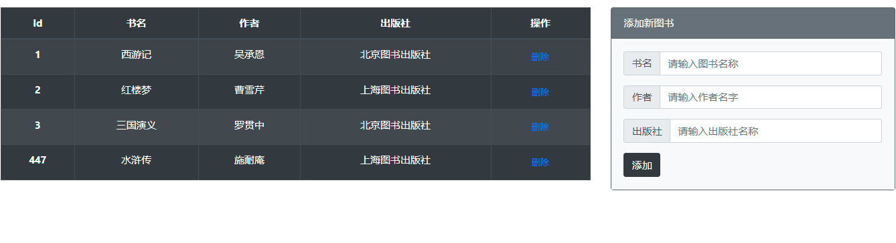

> /*思路分析 
>
>    1.页面一加载,ajax请求所有图书列表
>
>      \* 技术点：数据驱动渲染页面
>
>    2.点击添加按钮 ： 添加图书
>
>      \* 技术点: 获取form表单里面的参数,封装函数
>
>    3.点击删除按钮 ： 删除图书
>
>      \* 技术点: 动态新增按钮无法直接注册事件,需要使用 事件委托
>
>    4.页面所有的ajax请求都需要loading效果（全局loading）
>
>      \* 技术点: axios拦截器使用
>     
>     5.axios基地址
>
>    */

#### 1-查询图书列表

```javascript
// 函数1：封装渲染函数
      const renderData = (arr) => {
        document.querySelector('tbody').innerHTML = arr
          .map(
            (item) => ` <tr>
                <th scope="row">${item.id}</th>
                <td>${item.bookname}</td>
                <td>${item.author}</td>
                <td>${item.publisher}</td>
                <td>
                  <button type="button" class="btn btn-link btn-sm" data-id="${item.id}"> //自定义属性不能写在class里面
                    删除
                  </button>
                </td>
              </tr>`
          )
          .join('')
      }
 // 1.页面加载后，要初始化图书列表; 函数不调用不执行;
renderData()
```


#### 2-封装函数获取表单参数

```javascript
// 函数2.获取form表单参数
      const getFormData = () => {
        /* 1.form表单默认发送ajax请求：自动获取表单的name属性和value属性，拼接为name=value
           2.form表单name属性作用：告诉服务器，我发给你的数据是什么
           3.一般开发中,form表单的name属性设置与后台接口一样,  接口文档参数是什么,表单name就写什么
           */
        // (1)获取所有的表单
        let inputList = document.querySelectorAll('form input')
        // console.log(inputList)
        // (2)遍历表单，拼接为对象
        let obj = {}
        inputList.forEach((item) => {
          // console.log(item) //每个item都是input标签
          // 表单name : 接口参数名   表单value : 接口参数值
          obj[item.name] = item.value
        })
        return obj
      }

```


#### 3-新增图书

```javascript
// 函数3.axios请求图书列表，封装函数
      const getBookList = () => {
        axios({
          url: 'http://www.liulongbin.top:3006/api/getbooks',
          method: 'get',
        }).then((res) => {
          //成功回调
          console.log(res)
          const { data } = res.data
          renderData(data)
        })
      }

      // 1.页面一加载，axios请求图书列表
      getBookList()
      // 2.点击添加按钮
      document.querySelector('form .btn').onclick = function (e) {
        // 0.阻止表单默认跳转
        e.preventDefault()
        // 1.获取表单参数,对象转换为数组
        let data = getFormData()
        console.log(data)
        // 2.非空判断 开关思想
        /*
         arr.some():判断数组中是否有元素满足条件（只要有一个满足即可）
         arr.every():判断数组中是否所有元素满足条件（必须全部满足）
         Object.values(对象名)：获取对象所有的属性值，放入数组中
         */
        let res = Object.values(data).some((item) => item == '')
        // console.log(res) //只要一个为空就是true
        if (res) {
          return alert('请输入完整的数据')
        }
        // 3.ajax发请求
        axios({
          url: 'http://www.liulongbin.top:3006/api/addbook',
          method: 'post',
          data, //data:data data本身就是对象，ES6解构，属性名和属性值一致，可以省略一个
        }).then((res) => {
          //成功回调
          console.log(res)
          //错误提示
          if (res.data.status != 201) {
            return alert(res.data.msg)
          }
          // 新增成功：重新请求图书列表,不能Dom操作
          getBookList()
          // 清空表单
          document.querySelector('form').reset()
        })
      }
```


#### 4-删除图书

```javascript
 /*点击删除：动态新增按钮需要注册委托事件
      事件委托：给父元素注册事件，委托给子元素处理
      细节：注册的父元素也不能是动
      态新增的，如果不好分辨可以直接给body注册
      事件委托注意点：
      this：父元素
      e.target:事件目标（点击的子元素）
      */
      document.querySelector('tbody').onclick = function (e) {
        // console.log(e)
        // console.log(e.target)
        // 1.判断是否是委托的子元素
        if (e.target.classList.contains('btn-sm')) {
          // 2.获取当前按钮的自定义属性data-id（渲染的时候加自定义属性）
          //删除按钮需要增加两个属性 (1)类名用于判断  (2)自定义属性存储id
          let id = e.target.getAttribute('data-id')
          console.log(id)
          // 点击删除
          axios({
            url: 'http://www.liulongbin.top:3006/api/delbook',
            method: 'get',
            params: { id },
          }).then((res) => {
            //成功回调
            console.log(res)
            //删除失败
            if (res.data.status != 200) {
              return alert(res.data.msg)
            } else {
              // 删除成功
              alert(res.data.msg)
              // 重新请求图书列表
              getBookList()
            }
          })
        }
      }
```


#### 5-loading效果实现+axios基地址实现

**axios基地址：**

> ```
> axios.defaults.baseURL = 'https://api.example.com';
> ```

```html
<!DOCTYPE html>
<html lang="en">
  <head>
    <meta charset="UTF-8" />
    <meta http-equiv="X-UA-Compatible" content="IE=edge" />
    <meta name="viewport" content="width=device-width, initial-scale=1.0" />
    <title>Document</title>
    <!-- 引入 lib 目录下的 bootstrap 样式表 -->
    <link rel="stylesheet" href="./lib/bootstrap-v4.6.0.css" />
    <style>
      :root {
        font-size: 15px;
      }

      body {
        padding-top: 15px;
      }

      .loading-box {
        position: fixed;
        top: 30%;
        left: 50%;
        transform: translateX(-50%);
        background-color: rgba(0, 0, 0, 0.1);
        border-radius: 10px;
        box-shadow: 1px 1px 3px #efefef;
        display: none;
      }
    </style>
  </head>

  <body>
    <!-- 栅格系统 -->
    <div class="container-fluid">
      <!-- 栅格系统中的一行 -->
      <div class="row">
        <!-- 左侧的表格，占了 8 列 -->
        <div class="col-sm-8">
          <table
            class="table table-bordered table-striped table-dark table-hover text-center"
          >
            <thead>
              <!-- 表头行 -->
              <tr>
                <th scope="col">Id</th>
                <th scope="col">书名</th>
                <th scope="col">作者</th>
                <th scope="col">出版社</th>
                <th scope="col">操作</th>
              </tr>
            </thead>
            <tbody>
              <!-- 表格中的每一行 -->
              <tr>
                <th scope="row">xxx</th>
                <td>xxx</td>
                <td>xxx</td>
                <td>xxx</td>
                <td>
                  <button type="button" class="btn btn-link btn-sm">
                    删除
                  </button>
                </td>
              </tr>
            </tbody>
          </table>
        </div>

        <!-- 右侧的添加区域，占了 4 列 -->
        <div class="col-sm-4">
          <!-- 添加图书的卡片 -->
          <div class="card text-white bg-secondary sticky-top">
            <div class="card-header">添加新图书</div>
            <form class="card-body bg-light" id="addForm">
              <!-- 书名 -->
              <div class="input-group mb-3">
                <div class="input-group-prepend">
                  <span class="input-group-text">书名</span>
                </div>
                <input
                  type="text"
                  class="form-control"
                  placeholder="请输入图书名称"
                  name="bookname"
                />
              </div>
              <!-- 作者 -->
              <div class="input-group mb-3">
                <div class="input-group-prepend">
                  <span class="input-group-text">作者</span>
                </div>
                <input
                  type="text"
                  class="form-control"
                  placeholder="请输入作者名字"
                  name="author"
                />
              </div>
              <!-- 出版社 -->
              <div class="input-group mb-3">
                <div class="input-group-prepend">
                  <span class="input-group-text">出版社</span>
                </div>
                <input
                  type="text"
                  class="form-control"
                  placeholder="请输入出版社名称"
                  name="publisher"
                />
              </div>
              <!-- 添加按钮 -->
              <button class="btn btn-dark" type="submit">添加</button>
            </form>
          </div>
        </div>
      </div>
    </div>

    <!-- loading 区域 -->
    <div class="loading-box">
      <div class="spinner-border m-5 text-primary" role="status">
        <span class="sr-only">Loading...</span>
      </div>
    </div>
    <!-- 导入axios -->
    <script src="./lib/axios.js"></script>

    <script>
      /* 思路分析
      1.页面一加载,axios请求图书列表
       * 技术点: 封装渲染函数
      2.点击新增 : 新增图书
       * 技术点： form表单获取函数封装
      3.点击删除 ： 删除图书
       * 技术点:  事件委托技术 给动态新增元素注册事件
      4.loading效果(全局loading)
       * 技术点 ： axios拦截器
      5.axios基地址：一个公司所有的接口文档前面相同的部分
      */

      // axios基地址
      axios.defaults.baseURL = 'http://www.liulongbin.top:3006'
      /* axios拦截器使用*/
      // 添加请求拦截器
      axios.interceptors.request.use(
        function (config) {
          // 显示loading
          document.querySelector('.loading-box').style.display = 'block'
          // 在发送请求之前做些什么
          return config
        },
        function (error) {
          // 对请求错误做些什么
          return Promise.reject(error)
        }
      )
      // 添加响应拦截器
      axios.interceptors.response.use(
        function (response) {
          // 隐藏loading
          document.querySelector('.loading-box').style.display = 'none'
          // 对响应数据做点什么
          // 把服务器响应的数据返回给axios的then方法
          return response
        },
        function (error) {
          // 对响应错误做点什么
          document.querySelector('.loading-box').style.display = 'none' //失败了也要隐藏loading
          return Promise.reject(error)
        }
      )
      // 函数1：封装渲染函数
      const renderData = (arr) => {
        document.querySelector('tbody').innerHTML = arr
          .map(
            (item) => ` <tr>
                <th scope="row">${item.id}</th>
                <td>${item.bookname}</td>
                <td>${item.author}</td>
                <td>${item.publisher}</td>
                <td>
                  <button type="button" class="btn btn-link btn-sm " data-id="${item.id}">
                    删除
                  </button>
                </td>
              </tr>`
          )
          .join('')
      }

      // 函数2.获取form表单参数
      const getFormData = () => {
        /* 1.form表单默认发送ajax请求：自动获取表单的name属性和value属性，拼接为name=value
           2.form表单name属性作用：告诉服务器，我发给你的数据是什么
           3.一般开发中,form表单的name属性设置与后台接口一样,  接口文档参数是什么,表单name就写什么
           */
        // (1)获取所有的表单
        let inputList = document.querySelectorAll('form input')
        // console.log(inputList)
        // (2)遍历表单，拼接为对象
        let obj = {}
        inputList.forEach((item) => {
          // console.log(item) //每个item都是input标签
          // 表单name : 接口参数名   表单value : 接口参数值
          obj[item.name] = item.value
        })
        return obj
      }
      // 函数3.axios请求图书列表，封装函数
      const getBookList = () => {
        axios({
          url: '/api/getbooks',
          method: 'get',
        }).then((res) => {
          //成功回调
          const { data } = res.data
          // console.log(data)
          renderData(data)
        })
      }

      // 1.页面一加载，axios请求图书列表
      getBookList()
      // 2.点击添加按钮
      document.querySelector('form .btn').onclick = function (e) {
        // 0.阻止表单默认跳转
        e.preventDefault()
        // 1.获取表单参数,对象转换为数组
        let data = getFormData()
        console.log(data)
        // 2.非空判断 开关思想
        /*
         arr.some():判断数组中是否有元素满足条件（只要有一个满足即可）
         arr.every():判断数组中是否所有元素满足条件（必须全部满足）
         Object.values(对象名)：获取对象所有的属性值，放入数组中
         */
        let res = Object.values(data).some((item) => item == '')
        // console.log(res) //只要一个为空就是true
        if (res) {
          return alert('请输入完整的数据')
        }
        // 3.ajax发请求
        axios({
          url: '/api/addbook',
          method: 'post',
          data, //data:data data本身就是对象，ES6解构，属性名和属性值一致，可以省略一个
        }).then((res) => {
          //成功回调
          console.log(res)
          //错误提示
          if (res.data.status != 201) {
            return alert(res.data.msg)
          }
          // 新增成功：重新请求图书列表,不能Dom操作
          getBookList()
          // 清空表单
          document.querySelector('form').reset()
        })
      }

      /*点击删除：动态新增按钮需要注册委托事件
      事件委托：给父元素注册事件，委托给子元素处理
      细节：注册的父元素也不能是动
      态新增的，如果不好分辨可以直接给body注册
      事件委托注意点：
      this：父元素
      e.target:事件目标（点击的子元素）
      */
      document.querySelector('tbody').onclick = function (e) {
        // console.log(e)
        // console.log(e.target)
        // 1.判断是否是委托的子元素
        if (e.target.classList.contains('btn-sm')) {
          // 2.获取当前按钮的自定义属性data-id（渲染的时候加自定义属性）
          //删除按钮需要增加两个属性 (1)类名用于判断  (2)自定义属性存储id
          let id = e.target.getAttribute('data-id')
          console.log(id)
          // 点击删除
          axios({
            url: '/api/delbook',
            method: 'get',
            params: { id },
          }).then((res) => {
            //成功回调
            console.log(res)
            //删除失败
            if (res.data.status != 200) {
              return alert(res.data.msg)
            } else {
              // 删除成功
              alert(res.data.msg)
              // 重新请求图书列表
              getBookList()
            }
          })
        }
      }
    </script>
  </body>
</html>
```


#### 6-axios拦截器使用

	在请求或响应被 `then` 或 `catch` 处理前拦截它们。

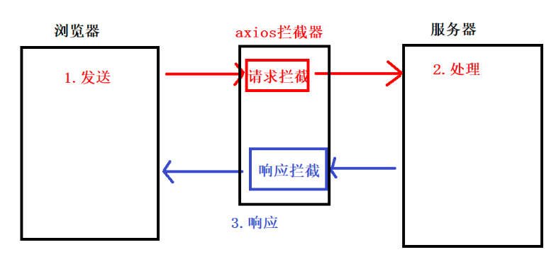

```html
<!DOCTYPE html>
<html lang="en">
  <head>
    <meta charset="UTF-8" />
    <meta http-equiv="X-UA-Compatible" content="IE=edge" />
    <meta name="viewport" content="width=device-width, initial-scale=1.0" />
    <title>Document</title>
    <link rel="stylesheet" href="./lib/bootstrap-v4.6.0.css" />
    <style>
      body {
        padding: 20px;
      }

      .loading-box {
        position: fixed;
        top: 30%;
        left: 50%;
        transform: translateX(-50%);
        background-color: rgba(0, 0, 0, 0.1);
        border-radius: 10px;
        box-shadow: 1px 1px 3px #efefef;
        display: none;
      }
    </style>
  </head>

  <body>
    <!-- 按钮 -->
    <button class="btn btn-primary" id="btn1">请求1</button>
    <button class="btn btn-info" id="btn2">请求2</button>
    <button class="btn btn-warning" id="btn3">请求3</button>

    <!-- loading 区域 -->
    <div class="loading-box">
      <div class="spinner-border m-5 text-primary" role="status">
        <span class="sr-only">Loading...</span>
      </div>
    </div>

    <script src="./lib/axios.js"></script>

    <script>
      /* 
      1.axios拦截器作用 :  拦截请求 + 拦截响应 
      
      2.axios拦截器执行流程
          2.1 axios发送请求
          2.2 执行请求拦截器 (发送服务器之前执行)
          2.3 发送给服务器
          2.4 服务器响应请求
          2.5 执行响应拦截器 (then方法之前执行)
          2.6 执行axios的then方法
      */

      // 添加请求拦截器
      axios.interceptors.request.use(
        function (config) {
          console.log(config) // ajax请求参数
          // 在发送请求之前做些什么
          // (1) axios 发送请求  (2)进入请求拦截器 (3)请求发送服务器
          // 显示loading
          document.querySelector('.loading-box').style.display = 'block'
          return config //本次请求的配置信息
        },
        function (error) {
          // 对请求错误做些什么（监听错误的）,固定语法
          return Promise.reject(error)
        }
      )

      // 添加响应拦截器
      axios.interceptors.response.use(
        function (response) {
          // 对响应数据做点什么
          // (1) 服务器响应  (2)执行响应拦截 (3)执行axios的then方法
          // 隐藏loading
          document.querySelector('.loading-box').style.display = 'none'
          return response //服务器响应数据
        },
        function (error) {
          // 对响应错误做点什么，固定语法
          return Promise.reject(error)
        }
      )
      //按钮1
      document.querySelector('#btn1').onclick = function () {
        axios({
          url: 'https://autumnfish.cn/fruitApi/fruits',
          method: 'get',
        }).then((res) => {
          //成功回调
          console.log(res)
        })
      }
      //按钮2
      document.querySelector('#btn2').onclick = function () {
        axios({
          url: 'https://autumnfish.cn/api/cq/category?type=剑士',
          method: 'get',
        }).then((res) => {
          //成功回调
          console.log(res)
        })
      }
      //按钮3
      document.querySelector('#btn3').onclick = function () {
        axios({
          url: 'http://www.liulongbin.top:3006/api/getbooks',
          method: 'get',
        }).then((res) => {
          //成功回调
          console.log(res)
        })
      }
    </script>
  </body>
</html>
```


### 十三、ajax补充知识点(【面试用】)

#### 1-onreadStateChange事件(了解)

- 官网文档传送门：https://www.runoob.com/ajax/ajax-xmlhttprequest-onreadystatechange.html

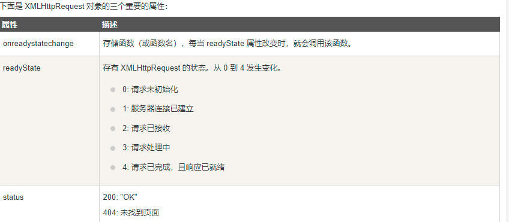


```html
 <script>
      /* 学习目标：XMLHttpRequest的两个事件+xhr对象的请求状态

        1. onload事件 ：  接收服务器响应的数（一次请求，只会执行一次）
        2. onreadystatechang事件 : xhr请求状态变化会执行
            作用与onload事件一致（一次请求，会执行多次）
            面试点： XMLHttpRequest对象的状态码 （xhr.readyState）
                0: 请求未初始化  (创建了xhr对象，但是还没调用open，即在open前打印可得0)
                1: 服务器连接已建立(open之后)
                2. 请求已接收  (服务器已经接收了请求，回调函数里面出现)
                3. 请求处理中  (服务器正在处理你的请求)
                4. 请求已完成，且响应已就绪 （ 服务器完成响应，4状态码等同于onload事件 ）

         */

      // (1)创建xhr
      let xhr = new XMLHttpRequest()

      //   请求未初始化
      console.log(xhr.readyState) //0
      // (2)设置请求方法和请求地址
      xhr.open('post', 'http://www.liulongbin.top:3009/api/login')

      //   服务器连接已建立
      console.log(xhr.readyState) //1
      // (3)设置请求
      xhr.setRequestHeader('Content-type', 'application/x-www-form-urlencoded')
      // (4)发送请求
      xhr.send('username=admin&password=123456')

      // (5)注册响应事件
      //   xhr.onload = function () {
      //     console.log(xhr.readyState) //4
      //     console.log(xhr.responseText) //{"code":200,"msg":"登录成功！"}
      //   }
      xhr.onreadystatechange = function () {
        //a. onload 是新式浏览器才支持的
        //b. 如果要兼容更早的浏览器，可以使用 onreadystatechange
        //c. onreadystatechange触发时机 ： xhr.readState状态变化

        console.log(xhr.readyState) //执行三次 2 3 4
        // 当readyState为4 ，表示响应数据了
        if (xhr.readyState == 4) {
          console.log(xhr.responseText)
        }
      }
    </script>
```


#### 2.Ajax组成部分了解(了解)

- Ajax(阿贾克斯)：全称  `Asynchronous Javascript And XML(异步的js与xml)`
  - 说人话： 用js发送异步的网络请求
  - A :  Asynchronous  异步
    - 同步 ： 指的是代码按照**从上往下**顺序执行
    - 异步 ： 代码不会立即执行,而是要等一会儿执行
      - 目前我们学过的ECMAScript只有两个语法是异步的： **定时器 与  ajax（联网需要时间，所以是异步）**
      - **DOM事件**也是属于异步的，但是这个是属于DOM的执行机制。所以一般在讨论js同步和异步的时候，主要以js为主，DOM一般不讨论。
  -  J ：Javascript
  - A ：And
  - X :  XML 与 XMLHttpRequest
    - XML ： 解决跨平台数据传输。（与json完全一致，是HTML的亲戚语言，标签）
      - 在JSON没有出来以前, 网络传输主要以XML格式数据为主。  后来JSON问世，逐渐取代XML。 但是由于ajax技术出来的比json早，因此xml这个称呼一直保留至今

##### 2.1 获取 json 格式的天气

- 请求地址：

  http://wthrcdn.etouch.cn/weather_mini

  - 示例：http://wthrcdn.etouch.cn/weather_mini?city=深圳

- 请求方法：get

- 请求参数：city

| 参数名 | 参数说明     | 备注               |
| ------ | ------------ | ------------------ |
| City   | 查询的城市名 | 不能为空，不能写错 |

- 响应内容：json

```javascript
{
  "data": {
    "yesterday": {
      "date": "15日星期三",
      "high": "高温 31℃",
      "fx": "无持续风向",
      "low": "低温 26℃",
      "fl": "<![CDATA[<3级]]>",
      "type": "多云"
    },
    "city": "深圳",
    "forecast": [
      {
        "date": "16日星期四",
        "high": "高温 32℃",
        "fengli": "<![CDATA[<3级]]>",
        "low": "低温 27℃",
        "fengxiang": "无持续风向",
        "type": "阵雨"
      },
      {
        "date": "17日星期五",
        "high": "高温 32℃",
        "fengli": "<![CDATA[<3级]]>",
        "low": "低温 27℃",
        "fengxiang": "无持续风向",
        "type": "雷阵雨"
      },
      {
        "date": "18日星期六",
        "high": "高温 32℃",
        "fengli": "<![CDATA[<3级]]>",
        "low": "低温 27℃",
        "fengxiang": "无持续风向",
        "type": "雷阵雨"
      },
      {
        "date": "19日星期天",
        "high": "高温 32℃",
        "fengli": "<![CDATA[<3级]]>",
        "low": "低温 25℃",
        "fengxiang": "无持续风向",
        "type": "雷阵雨"
      },
      {
        "date": "20日星期一",
        "high": "高温 29℃",
        "fengli": "<![CDATA[<3级]]>",
        "low": "低温 24℃",
        "fengxiang": "无持续风向",
        "type": "阵雨"
      }
    ],
    "ganmao": "各项气象条件适宜，发生感冒机率较低。但请避免长期处于空调房间中，以防感冒。",
    "wendu": "30"
  },
  "status": 1000,
  "desc": "OK"
}
```

##### 2.2 获取 xml 格式菜单

- 请求地址：https://autumnfish.cn/api/food.xml
- 请求方法：get
- 请求参数：无
- 响应内容：

```xml
<?xml version="1.0" encoding="UTF-8"?>
<breakfast_menu>
	<food>
		<name>Belgian Waffles</name>
		<price>$5.95</price>
		<description>Two of our famous Belgian Waffles with plenty of real maple syrup</description>
		<calories>650</calories>
	</food>
	<food>
		<name>Strawberry Belgian Waffles</name>
		<price>$7.95</price>
		<description>Light Belgian waffles covered with strawberries and whipped cream</description>
		<calories>900</calories>
	</food>
	<food>
		<name>Berry-Berry Belgian Waffles</name>
		<price>$8.95</price>
		<description>Light Belgian waffles covered with an assortment of fresh berries and whipped cream</description>
		<calories>900</calories>
	</food>
	<food>
		<name>French Toast</name>
		<price>$4.50</price>
		<description>Thick slices made from our homemade sourdough bread</description>
		<calories>600</calories>
	</food>
	<food>
		<name>Homestyle Breakfast</name>
		<price>$6.95</price>
		<description>Two eggs, bacon or sausage, toast, and our ever-popular hash browns</description>
		<calories>950</calories>
	</food>
</breakfast_menu>
```


#### 【3-get请求与post请求区别(掌握)】

- 1.传参方式不同
  - get在url后面拼接(请求行 ；请求行参数**随着url一次性传过去**)
  - post在请求体传参（请求体参数：**分为很多次传递，数据流**）
- 2.大小限制不同
  - get有大小限制，不同浏览器大小限制不同。 一般2-5 MB
  - post没有大小限制（如：文件上传）
- 3.安全性不同
  - get参数直接暴露在url，不安全(一般查询类数据都是get)
  - post参数在请求体中，更加安全（一般登录注册必须是post）
- 4.传输速度不同
  - get传输速度快
  - post传输速度慢


#### 【4-其他请求方法了解(掌握)】

- `实际开发中，前端无权决定请求方法，只需要根据后台接口文档来就可以了`
- put和patch区别
  * 全局更新：put
  * 局部更新：patch

| 请求方式 | 描述                 | 特点            |
| -------- | -------------------- | --------------- |
| post     | 一般用于新增数据     | 请求体传参      |
| get      | 一般用于查询数据     | 请求行(url)传参 |
| delete   | 一般用于删除数据     | 请求体传参      |
| put      | 一般用于更新全部数据 | 请求体传参      |
| patch    | 一般用于更新局部数据 | 请求体传参      |

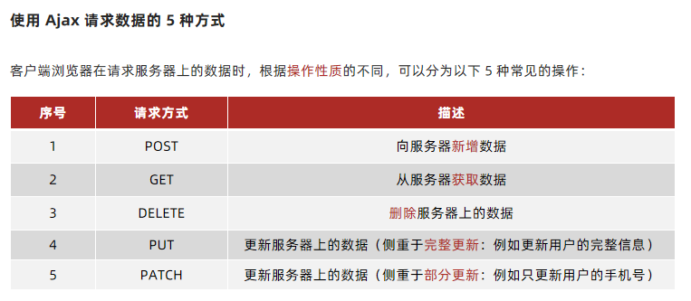


#### 5. Ajax工作原理

##### 5.1-HTTP协议原理与ajax工作原理

- 课后学习传送门（一个网站从输入网址到呈现页面完整流程）
  - <https://www.jianshu.com/p/c93d47c26a81>
- 课后学习传送门： 查看各种响应状态码含义
  - https://developer.mozilla.org/zh-CN/docs/Web/HTTP/Status/100


- 1.什么HTTP协议

  - 协议指的是规定浏览器跟服务器交互的数据格式

- 2.浏览器请求 必须是：`请求报文`

- 3.服务器响应 必须是：`响应报文`

- 4.请求报文与响应报文的数据格式如下

  - a.请求报文

    - (1)请求行 ： 包含请求方法, 请求地址（URL）, 协议版本
    - (2)请求头：（浏览器告诉服务器，我发给你的数据是什么类型 ；如：文本、json、图片、音视频等）。包含请求的附加信息, 由关键字/值对组成
    - (3)请求体：浏览器发送给服务器的数据(`参数`)

  - b.响应报文

    - (1)响应行：包含协议版本, 状态码, 状态码描述
      - 1xx, 指示信息, 表示请求已接收, 继续处理
      - `2xx, 成功, 表示请求已被成功接收和处理.`
        - 200：成功
        - 204：正在加载，马上就好
      - 3xx, 重定向, 表示要完成请求必须进行更进一步操作
        - 302：服务器重定向（服务器主动修改浏览器网站）
      - `4xx, 客户端错误（前端的问题）, 表示有语法错误或请求无法实现`
        - 404：url写错
        - 400：参数写错
        - 403/402：没有权限（有的网页需要登录才能进入，未登录返回403/402）
        - 405：请求方法错误
      - `5xx, 服务器端（后端的问题）错误, 表示服务器未能实现合法的请求`
        - 500：服务器挂了（后台java代码像js一样爆红了）
    - (2)响应头:content-type 返回的数据格式（服务器告诉浏览器，我响应给你的数据是什么类型），jQuery自动转JSON就是根据他来判断的
    - (3)响应体：服务器响应给浏览器的数据 （`xhr.responseText`）

    

    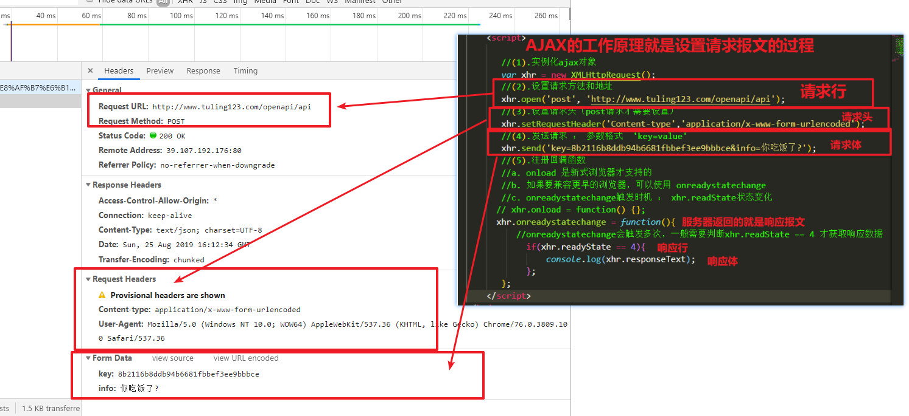


```html
<!DOCTYPE html>
<html lang="en">
  <head>
    <meta charset="UTF-8" />
    <meta name="viewport" content="width=device-width, initial-scale=1.0" />
    <meta http-equiv="X-UA-Compatible" content="ie=edge" />
    <title>Document</title>
  </head>
  <body>
    <script>
      /* 
        1.HTTP : 网络传输协议
            * 协议 ： 约定 数据传输格式
        2.HTTP协议组成部分
            2.1 请求报文
            2.2 响应报文
        3. 请求报文三个组成部分
            3.1 请求行 ： 包含请求方法, URL, 协议版本
            3.2 请求头 ： 浏览器告诉服务器，我给的数据是什么格式 （content-type在请求头中）
            3.3 请求体 ： post请求参数在请求体中
        4. 响应报文三个组成部分
            4.1 响应行 ： 包含协议版本, 状态码, 状态码描述
                2开头 ： 请求成功  200
                3开头 ： 重定向  302  
                4开头 ： 前端问题  400参数错误   401 没有权限  404 url错误
                5开头 ： 后台问题  500 服务器bug,可以理解为后台java代码爆红
            4.2 响应头 ： 浏览器告诉服务器，我给你的数据是什么格式 （浏览器会自动识别）
            4.3 响应体 ： 后台响应的数据，一般是json格式
        5.ajax原理： 设置http请求报文的过程
         */

      //(1).实例化ajax对象
      let xhr = new XMLHttpRequest()
      //(2).设置请求方法和地址
      xhr.open("post", "http://www.liulongbin.top:3009/api/login")
      //(3).设置请求头（post请求才需要设置）
      xhr.setRequestHeader("Content-type", "application/x-www-form-urlencoded")
      //(4).发送请求 ： 参数格式  'key=value'
      xhr.send("username=admin&password=123456")
      //(5).注册回调函数
      // xhr.onload = function() {};
      xhr.onreadystatechange = function() {
        //onreadystatechange会触发多次，一般需要判断xhr.readState == 4 才获取响应数据
        if (xhr.readyState == 4) {
          console.log(xhr.responseText)
        }
      }
    </script>
  </body>
</html>

```


##### 5.2-一个页面从输入url到呈现过程

- 相关知识点参考：https://www.jianshu.com/p/c93d47c26a81

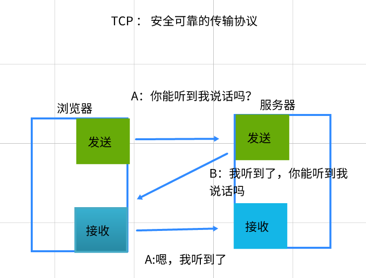

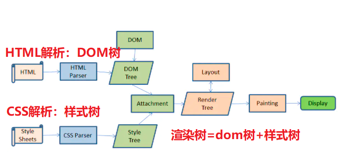

- 1.DNS域名解析： 将url中的域名解析成ip地址

- 2.TCP三次握手： 建立安全的网络传输协议

  - 2.1 什么是TCP : 一种 传输控制协议

  - 2.2 TCP作用 :  保证HTTP网络传输是 安全 + 可靠的 （检测客户端 与 服务器的网卡是不是通的）

  - 2.3 TCP三次握手 : 

                    第一次:  浏览器  -> 服务器   (你能听到我说话吗?,检测浏览器:发送)
                      
                    第二次:  服务器  -> 浏览器   (我听到了,你能听到我说话吗。 检测浏服务器: 接收 + 发送)
                      
                    第三次:  浏览器 -> 服务器    (嗯,我听到了. 检测浏览器: 接收)

- 3.HTTP建立连接 

  - 3.1 客户端发送请求
  - 3.2 服务器处理请求
  - 3.3 服务器响应请求

- 4.服务器响应数据后，渲染引擎开始渲染响应返回的HTML文本

  - 4.1 解析html生成：dom树
  - 4.2 解析css生成：样式树
  - 4.3 dom树 与 样式树 合并得到 渲染树
  - 4.4 呈现页面


#### 6. 函数防抖与节流(面试+应用)

##### 1. 函数防抖

- 函数防抖：单位时间内，频繁触发事件，只会触发最后一次
- 函数防抖实际开发应用场景： 实时获取输入框文本

```html
<body>
    <input type="text" placeholder="请输入文本" />

    <script>
      /*
              1.函数防抖 : 单位时间内，频繁触发一个事件， 以'最后一次'触发为准
              2.防抖应用场景: 输入框输入事件
              3.防抖流程 :
                  3.1 声明一个全局变量存储定时器ID
                  3.2 每一次触发交互的时候，先清除上一次定时器。 然后把本次事件处理代码放入定时器中
              4.oninput事件用户只要打字就触发
                  */

      let timeId = null
      document.querySelector('input').oninput = function () {
        // 1.先清除之前的定时器
        clearTimeout(timeId)
        // 2.开启本次定时器
        timeId = setTimeout(() => {
          // function函数：this->window
          // 箭头函数： this->上一级this
          console.log(`发送ajax,内容是${this.value}`)
        }, 500)
      }
    </script>
  </body>
```


##### 2. 函数节流

- 函数节流：单位时间内，频繁触发事件，只会触发一次
- 函数节流应用场景 ： 解决高频事件，频繁触发事件浪费性能

```html
<!DOCTYPE html>
<html lang="en">
  <head>
    <meta charset="UTF-8" />
    <meta name="viewport" content="width=device-width, initial-scale=1.0" />
    <meta http-equiv="X-UA-Compatible" content="ie=edge" />
    <title>Document</title>
    <style>
      body {
        width: 3000px;
        height: 3000px;
      }
    </style>
  </head>
  <body>
    <script>
      /* 
        1.函数节流 : 单位时间内，频繁触发一个事件， 只会触发一次
        2.节流场景 : 解决高频事件 （滚动条事件高频触发）
        3.节流实现:
            3.1 声明一个全局变量存储触发时间   let lastTime = null
            3.2 每一次触发事件，获取当前时间   let currentTime = Date.now()
            3.3 判断 当前时间 与 上一次触发时间，是否超过间隔   currentTime-lastTime>=500
            3.4 如果超过触发间隔，则执行事件处理代码。 然后存储本次触发事件  lastTime = currentTime
        */

      //声明一个全局变量存储触发时间
      let lastTime = null
      let i = 0
      window.onscroll = function () {
        // 1.每一次触发，先获取本次的时间戳
        let currentTime = Date.now()
        // console.log(currentTime)

        // 2.判断当前时间与上一次触发事件是否超过间隔
        if (currentTime - lastTime >= 500) {
          console.log(document.documentElement.scrollTop, i++)
          //   3.存储本次触发时间
          lastTime = currentTime
        }
      }
    </script>
  </body>
</html>
```


### 十四、文件上传


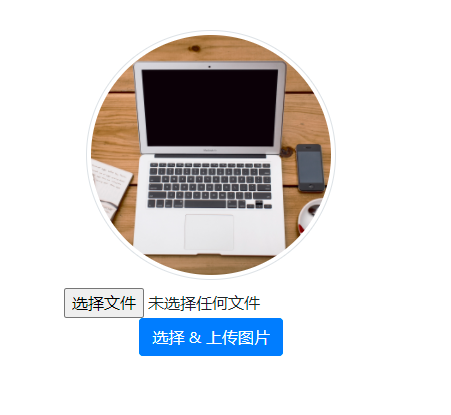


- FormData对象官方文档：https://developer.mozilla.org/zh-CN/docs/Web/API/FormData
- 文件上传必须要FormData对象 ： 因为文件数据 和 文本数据 在传输的时候，数据格式不同。需要formdata对象进行自动处理。

#### 1. 文件上传思路

```html
<!DOCTYPE html>
<html lang="en">
  <head>
    <meta charset="UTF-8" />
    <meta http-equiv="X-UA-Compatible" content="IE=edge" />
    <meta name="viewport" content="width=device-width, initial-scale=1.0" />
    <title>案例-头像上传</title>
    <link rel="stylesheet" href="./lib/bootstrap-v4.6.0.css" />
    <style>
      .thumb-box {
        text-align: center;
        margin-top: 50px;
      }

      .thumb {
        width: 250px;
        height: 250px;
        object-fit: cover;
        border-radius: 50%;
      }
    </style>
  </head>

  <body>
    <div class="thumb-box">
      <!-- 头像 -->
      
      <div class="mt-2">
        <!-- 文件选择框 -->
        <!-- accept 属性表示可选择的文件类型 -->
        <!-- image/* 表示只允许选择图片类型的文件 -->
        <input type="file" id="iptFile" accept="image/*" />
        <br />
      </div>
    </div>

    >
    <script src="./lib/axios.js"></script>

    <script>
      /*文件上传 
      1.前置知识点
        1.1 file表单, 默认自带点击事件，作用是选择文件
        1.2 上传文件‘必须’要使用原生内置的FormData对象
          (1)文件需要设置单独的请求头 : multipart/form-data(FormData自动创建)
          (2)文件以二进制方式传输（文本是utf8编码，但是文件不是）
        1.3 file表单有一个特殊的事件onchange事件 ： 用户选择了文件就会执行

      2.文件上传流程
        2.1 在file表单的onchange事件中获取用户选择的图片
           this.files[0]
        2.2 创建FormData对象,将图片添加到fd对象中
          let fd = new FormData()
          fd.append('接口参数',文件数据)
        2.3 ajax发送请求 : 参数必须是formdata对象
       */

      //  1.给file表单注册onchange事件
      document.querySelector('#iptFile').onchange = function () {
        // console.log(this) //file表单
        // 2.获取用户选择的文件
        /* 
        this.files:伪数组，存储所有的选中的文件
        this.files[0]:取出第一个文件
        */
        let file = this.files[0]
        // 非空判断，如果内容为undefined，给出提示
        if (file == undefined) {
          return alert('请选择上传文件！')
        }
        // console.log(file)
        // 3.创建FormData对象,只有FormData对象才可以上传文件
        let fd = new FormData()
        // 4.调用append方法追加文件 fd.append('后台参数名'，待追加的文件')
        fd.append('avatar', file)
        // 5.ajax发送请求
        axios({
          url: 'http://www.liulongbin.top:3009/api/upload/avatar',
          method: 'post',
          /* 将FormData对象作为参数，fd对象会自动帮我们设置请求头，自动处理文件参数 */
          data: fd, //fd是对象，不需要加{}
        }).then((res) => {
          //成功回调
          console.log(res)
          if (res.code != 200) {
            return alert(res.message)
          }
          // 6.显示上传成功的图片
          document.querySelector(
            '.thumb'
          ).src = `http://www.liulongbin.top:3009${res.data.url}`
        })
      }
    </script>
  </body>
</html>
```


#### 2. 自定义文件上传按钮

- file表单自带的按钮样式太丑，我们可以自定义一个文件上传按钮

```html
<!DOCTYPE html>
<html lang="en">
  <head>
    <meta charset="UTF-8" />
    <meta http-equiv="X-UA-Compatible" content="IE=edge" />
    <meta name="viewport" content="width=device-width, initial-scale=1.0" />
    <title>案例-头像上传</title>
    <link rel="stylesheet" href="./lib/bootstrap-v4.6.0.css" />
    <style>
      .thumb-box {
        text-align: center;
        margin-top: 50px;
      }

      .thumb {
        width: 250px;
        height: 250px;
        object-fit: cover;
        border-radius: 50%;
      }
    </style>
  </head>

  <body>
    <div class="thumb-box">
      <!-- 头像 -->
      
      <div class="mt-2">
        <!-- 文件选择框 -->
        <!-- accept 属性表示可选择的文件类型 -->
        <!-- image/* 表示只允许选择图片类型的文件 -->
        <input
          type="file"
          id="iptFile"
          accept="image/*"
          style="display: none"
        />
        <br />
        <!-- 选择头像图片的按钮 -->
        <button class="btn btn-primary" id="btnChoose">选择 & 上传图片</button>
      </div>
    </div>

    <!-- label标签有一个独有的for属性, 它的值是 input元素的id 
        for作用： 让label与input建立关联。 点击了label相当于点击了input
    -->
	<label for="iptFile">
      
    </label>

    <script src="./lib/axios.js"></script>

    <script>
      /* 自定义文件上传按钮思路
          1.隐藏file表单
          2.给自定义按钮注册点击事件，点击触发 file表单‘默认’点击事件
             触发注册点击事件：  dom元素.onclick()
             触发‘默认’点击事件：dom元素.click()
      */

      // 点击自定义按钮
      document.querySelector('#btnChoose').onclick = function () {
        // 触发file表单点击事件即可
        /* 
        dom对象.onclick() :只能触发注册的点击事件，没有注册则无法触发
        dom对象.click()   :会触发注册的 + 触发标签的默认点击事件(a标签、form按钮、file表单)
        */
        document.querySelector('#iptFile').click()
      }

      // 1.给file表单注册onchange事件：选择文件触发
      document.querySelector('#iptFile').onchange = function () {
        // 2.获取表单文件值
        let file = this.files[0]
        // 非空判断，如果内容为undefined，给出提示
        if (file == undefined) {
          return alert('请选择上传文件！')
        }
        // 3.创建FormDate对象
        let fd = new FormData()
        fd.append('avatar', file)
        // 4.发送ajax
        axios({
          url: 'http://www.liulongbin.top:3009/api/upload/avatar',
          method: 'post',
          data: fd,
        }).then((res) => {
          //成功回调
          console.log(res)
        })
      }
    </script>
  </body>
</html>
```


### 十五、案例-英雄管理

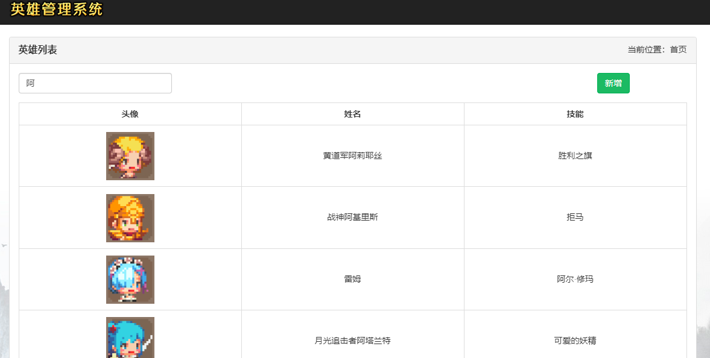

#### 1-项目分析

- 1.需求分析
  - 首页（查询英雄列表）
    - ajax请求数据
    - 输入框搜索事件
  - 增加英雄
    - 选择文件，实现图片预览功能
    - 点击提交，ajax提交表单数据（包含文件提交）
    - 响应成功之后，跳转首页
- 2.技术点分析
  - （1）文件预览
  - （2）文件上传服务器

#### 2-查询英雄

```html
<!DOCTYPE html>
<html lang="zh-cn">
  <head>
    <meta charset="utf-8" />
    <meta http-equiv="X-UA-Compatible" content="IE=edge" />
    <meta name="viewport" content="width=device-width, initial-scale=1" />
    <!-- 导包 -->
    <script src="./lib/js/jquery-1.12.4.js"></script>
    <script src="./lib/js/bootstrap.js"></script>
    <link rel="stylesheet" href="./lib/css/bootstrap.min.css" />
    <title>首页</title>
    <style>
      .wrap {
        position: fixed;
        left: 0;
        top: 0;
        width: 100%;
        height: 100%;
        background: url('images/bg03.jpg') center bottom no-repeat;
        overflow: auto;
      }

      .navbar-brand {
        padding: 10px 15px;
      }

      .logout {
        font-weight: 900;
        font-size: 20px;
        color: #ff0000;
        text-decoration: none;
      }

      .logout:hover {
        text-decoration: none;
        color: yellowgreen;
      }

      #my-table th {
        text-align: center;
      }

      #my-table td {
        text-align: center;
        line-height: 80px;
        padding: 0;
        padding: 10px;
      }

      td img {
        width: 80px;
        height: 80px;
      }

      .username {
        font-weight: 900;
        color: hotpink;
        background-color: yellowgreen;
      }

      .pagination {
        margin: 0px;
        padding: 0px;
        font-size: 0;
        line-height: 1;
      }

      .pagination li {
        display: inline-block;
        font-size: 14px;
      }

      .mp15 {
        margin-top: 15px;
      }

      .table {
        margin-bottom: 0;
      }

      .table-bordered > thead > tr > td,
      .table-bordered > thead > tr > th {
        border-bottom-width: 1px;
      }

      .page-title {
        font-size: 16px;
        font-weight: bold;
      }
    </style>
  </head>

  <body>
    <div class="wrap">
      <nav class="navbar navbar-inverse navbar-static-top">
        <div class="container">
          <div class="navbar-header">
            <button
              type="button"
              class="navbar-toggle collapsed"
              data-toggle="collapse"
              data-target="#mymenu"
            >
              <span class="sr-only">Toggle navigation</span>
              <span class="icon-bar"></span>
              <span class="icon-bar"></span>
              <span class="icon-bar"></span>
            </button>
            <a class="navbar-brand" href="#"></a>
          </div>
        </div>
      </nav>

      <div class="container">
        <div class="row">
          <div class="col-md-12">
            <div class="panel panel-default">
              <div class="panel-heading clearfix">
                <div class="row">
                  <div class="col-md-6 page-title">英雄列表</div>
                  <div class="col-md-6 text-right">当前位置：首页</div>
                </div>
              </div>
              <div class="panel-body">
                <div class="row">
                  <div class="col-md-3">
                    <input
                      class="search form-control"
                      type="text"
                      placeholder="请输入英雄名称,enter键搜索"
                    />
                  </div>
                  <div class="col-md-5"></div>
                  <div class="col-md-3">
                    <a href="./add.html" class="btn btn-success pull-right"
                      >新增</a
                    >
                  </div>
                </div>

                <table id="my-table" class="table table-bordered mp15">
                  <thead>
                    <tr>
                      <th width="25%">头像</th>
                      <th width="25%">姓名</th>
                      <th width="25%">技能</th>
                    </tr>
                  </thead>
                  <tbody>
                    <tr>
                      <td></td>
                      <td>盖伦</td>
                      <td>躲草丛</td>
                    </tr>
                  </tbody>
                </table>
              </div>
            </div>
          </div>
        </div>
      </div>
    </div>

    <!-- 导入axios -->
    <script src="./lib/axios.js"></script>

    <script>
      /*
       1.页面一加载，ajax请求英雄列表
       2.输入框enter事件
       */

      //1.页面一加载，ajax请求英雄列表
      axios({
        url: 'https://autumnfish.cn/api/cq/page',
        method: 'get',
        params: { pageNum: 1, pageSize: 20 },
      }).then((res) => {
        //成功回调
        let { list } = res.data
        // console.log(list)
        renderData(list)
      })

      // 2.搜索功能,输入框enter事件：给输入框注册键盘按下，判断是否为enter键
      document.querySelector('.search').onkeydown = function (e) {
        // console.log(e.key)
        if (e.key == 'Enter') {
          //按了enter键
          // console.log(this.value)
          axios({
            url: 'https://autumnfish.cn/api/cq',
            method: 'get',
            params: { query: this.value },
          }).then((res) => {
            //成功回调
            const { list } = res.data
            // console.log(list)
            renderData(list)
            // 查询完清空文本框
            this.value = ''
          })
        }
      }
      //封装渲染数据函数
      const renderData = (arr) => {
        document.querySelector('tbody').innerHTML = arr
          .map(
            (item) =>
              `<tr>
                  <td></td>
                  <td>${item.name}</td>
                  <td>${item.skill}</td>
               </tr>`
          )
          .join('')
      }
    </script>
  </body>
</html>
```


#### 3-输入框enter事件

```javascript
 // 2.搜索功能,输入框enter事件：给输入框注册键盘按下，判断是否为enter键
      document.querySelector('.search').onkeydown = function (e) {
        // console.log(e.key)
        if (e.key == 'Enter') {
          //按了enter键
          // console.log(this.value)
          axios({
            url: 'https://autumnfish.cn/api/cq',
            method: 'get',
            params: { query: this.value },
          }).then((res) => {
            //成功回调
            const { list } = res.data
            // console.log(list)
            renderData(list)
            // 查询完清空文本框
            this.value = ''
          })
        }
      }
```


#### 4-增加英雄(FormData上传文件+文件预览)

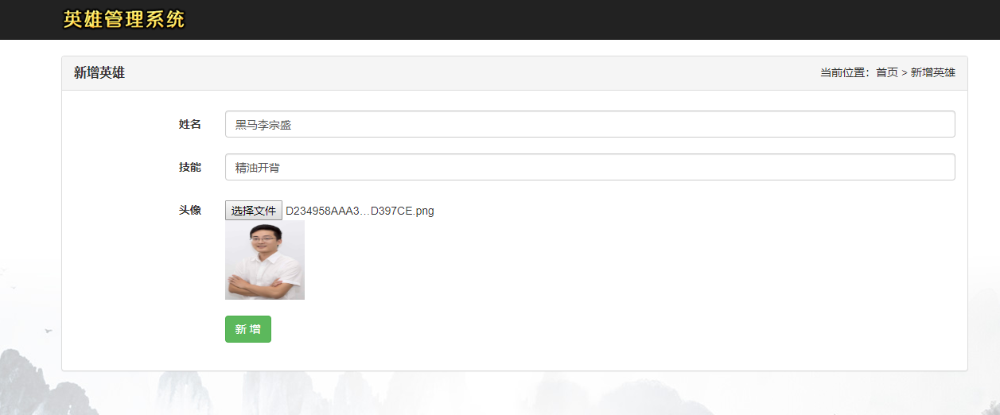


- URL.createObjectURL官方文档：https://developer.mozilla.org/zh-CN/docs/Web/API/URL/createObjectURL

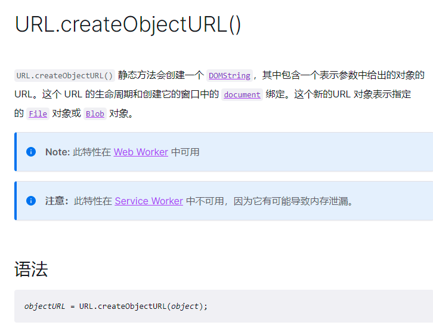


- 

```javascript
<!DOCTYPE html>
<html lang="zh-cn">
  <head>
    <meta charset="utf-8" />
    <meta http-equiv="X-UA-Compatible" content="IE=edge" />
    <meta name="viewport" content="width=device-width, initial-scale=1" />
    <title>添加英雄</title>
    <!-- 导包 -->
    <script src="./lib/js/jquery-1.12.4.js"></script>
    <script src="./lib/js/bootstrap.js"></script>
    <link rel="stylesheet" href="./lib/css/bootstrap.min.css" />
    <style>
      .wrap {
        position: fixed;
        left: 0;
        top: 0;
        width: 100%;
        height: 100%;
        background: url('images/bg03.jpg') center bottom no-repeat;
        overflow: auto;
      }

      .navbar-brand {
        padding: 10px 15px;
      }

      .page-title {
        font-size: 16px;
        font-weight: bold;
      }

      .file-input {
        outline: none;
        display: inline-block;
        margin-top: 5px;
      }

      .form-group {
        margin-bottom: 20px;
      }

      .form-horizontal {
        margin-top: 10px;
      }

      .logout {
        font-weight: 900;
        font-size: 20px;
        color: #ff0000;
        text-decoration: none;
      }

      .logout:hover {
        text-decoration: none;
        color: yellowgreen;
      }

      .preview {
        width: 100px;
        height: 100px;
      }
    </style>
  </head>

  <body>
    <div class="wrap">
      <nav class="navbar navbar-inverse navbar-static-top">
        <div class="container">
          <div class="navbar-header">
            <button
              type="button"
              class="navbar-toggle collapsed"
              data-toggle="collapse"
              data-target="#mymenu"
            >
              <span class="sr-only">Toggle navigation</span>
              <span class="icon-bar"></span>
              <span class="icon-bar"></span>
              <span class="icon-bar"></span>
            </button>
            <a class="navbar-brand" href="#"></a>
          </div>
        </div>
      </nav>

      <div class="container">
        <div class="row">
          <div class="col-md-12">
            <div class="panel panel-default">
              <div class="panel-heading clearfix">
                <div class="row">
                  <div class="col-md-6 page-title">新增英雄</div>
                  <div class="col-md-6 text-right">
                    当前位置：首页 &gt; 新增英雄
                  </div>
                </div>
              </div>
              <div class="panel-body">
                <form action="#" method="" class="form-horizontal">
                  <div class="form-group">
                    <label for="heroName" class="col-sm-2 control-label"
                      >姓名</label
                    >
                    <div class="col-sm-10">
                      <input
                        type="text"
                        class="form-control"
                        id="heroName"
                        name="name"
                        placeholder="请输入姓名"
                      />
                    </div>
                  </div>
                  <div class="form-group">
                    <label for="skillName" class="col-sm-2 control-label"
                      >技能</label
                    >
                    <div class="col-sm-10">
                      <input
                        type="text"
                        class="form-control"
                        id="heroSkill"
                        name="skill"
                        placeholder="请输入技能"
                      />
                    </div>
                  </div>
                  <div class="form-group">
                    <label for="heroIcon" class="col-sm-2 control-label"
                      >头像</label
                    >
                    <div class="col-sm-10">
                      <!-- img仅仅是用来显示图片的,真正用来选择头像文件的还是input标签 -->
                      <input
                        type="file"
                        class="file-input"
                        id="heroIcon"
                        name="icon"
                      />
                      
                    </div>
                  </div>
                  <div class="form-group">
                    <div class="col-sm-offset-2 col-sm-10">
                      <button type="submit" class="btn btn-success btn-add">
                        新 增
                      </button>
                    </div>
                  </div>
                </form>
              </div>
            </div>
          </div>
        </div>
      </div>
    </div>

    <!-- 导入axios -->
    <script src="./lib/axios.js"></script>

    <script>
      /* 
      1.文件预览功能
      2.点击新增: ajax提交数据(名字、技能、图像)
      */

      //文件预览由 四个固定的步骤组成

      //1.给file表单注册onchange事件 : 用户选择文件
      document.querySelector('#heroIcon').onchange = function () {
        // 2.获取用户选择的文件
        let file = this.files[0]
        console.log(file)
        // 3.将file对象转换为url路径
        let url = URL.createObjectURL(file) //返回一个url,只能在内网使用
        console.log(url)
        // 4.将url路径设置给img标签的src
        document.querySelector('.preview').src = url
      }
      //2.点击新增：ajax提交数据
      document.querySelector('.btn-add').onclick = function (e) {
        // 1.阻止默认跳转
        e.preventDefault()
        // 2.创建formData对象
        let fd = new FormData()

        // 3.添加参数
        fd.append('heroName', document.querySelector('#heroName').value)
        fd.append('heroSkill', document.querySelector('#heroSkill').value)
        fd.append('heroIcon', document.querySelector('#heroIcon').files[0])
        console.log(fd)
        // 4.发送ajax
        axios({
          url: 'https://autumnfish.cn/api/cq/add',
          method: 'post',
          data: fd,
        }).then((res) => {
          //成功回调
          // console.log(res)
          const { code, msg } = res.data
          if (code == 201) {
            alert(msg)
            // 跳转首页
            location.href = './index.html'
          } else {
            alert(msg)
          }
        })
      }
    </script>
  </body>
</html>
```


#### 5-案例总结

- 1.文件预览功能思路(`这是一个固定流程的功能`)
  - 1.1 给file表单设置 onchange事件
  - 1.2 获取选取的文件 ： this.files[0]
  - 1.3 创建临时url ： URL.createObjectURL()
  - 1.4 显示到页面
- 2.文件上传功能思路
  - 2.1 阻止表单默认提交事件 ： e.preventDefault();
  - 2.2`创建FormData对象 ： new FormData(表单form)`
  - 2.3 `ajax发送post请求`
  - 2.4 成功之后跳转回首页
